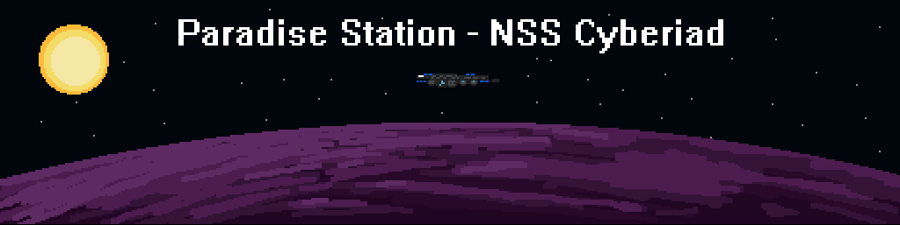

## 
Welcome to the main repository for the Paradise Station version of [Space Station 13](https://spacestation13.com/).

	
	
	
	

	
	
	

	<a href="https://discord.gg/paradisess13">
		<picture>
			<source media="(prefers-color-scheme: dark)" srcset=".github/assets/discord-light.png">
			<source media="(prefers-color-scheme: light)" srcset=".github/assets/discord-dark.png">
			
		</picture>
	</a>
	<a href="https://devdocs.paradisestation.org">
		<picture>
			<source media="(prefers-color-scheme: dark)" srcset=".github/assets/book-light.png">
			<source media="(prefers-color-scheme: light)" srcset=".github/assets/book-dark.png">
			
		</picture>
	</a>
	<a href="https://www.paradisestation.org/">
		<picture>
			<source media="(prefers-color-scheme: dark)" srcset=".github/assets/web-light.png">
			<source media="(prefers-color-scheme: light)" srcset=".github/assets/web-dark.png">
			
		</picture>
	</a>
	<a href="https://paradisestation.org/wiki">
		<picture>
			<source media="(prefers-color-scheme: dark)" srcset=".github/assets/wiki-light.png">
			<source media="(prefers-color-scheme: light)" srcset=".github/assets/wiki-dark.png">
			
		</picture>
	</a>

> [!TIP]
> Want to contribute for the first time but unsure where to start? 
> Join our Discord and check out the [#coding_chat](https://discord.com/channels/145533722026967040/145700319819464704) channel for helpful links and advice! 
> Alternatively, have a look at our community maintained [Getting Started Guide](https://devdocs.paradisestation.org/contributing/getting_started/)

# Useful Documents and Links

- ### [Dream Maker (DM) Reference](https://www.byond.com/docs/ref/)

This reference site by the creators of BYOND details information on the DM language, the syntax used, functionality of native procs, and a lot more. This is always useful to have on hand when contributing.

- ### [Autodocumentation Guide](https://devdocs.paradisestation.org/references/autodoc/)

This guide shows you how to leave code comments that comply with "autodocumentation", a system designed to make everyone's lives easier when reading or reviewing code!

- ### [Code of Conduct](https://devdocs.paradisestation.org/code_of_conduct/)

All contributors are expected to read our Code of Conduct before they take part in our community.

- ### [Contribution Guide](https://devdocs.paradisestation.org/contributing/)

Not sure how to take part and contribute? This guide gives an overview of how to make comments, pull requests, and open issues.

This guide also sets out our code standards that we expect all submitted code to adhere to.

- ### [Community Maintained Guide to Contributing](https://devdocs.paradisestation.org/contributing/getting_started/)

This community maintained guide covers how to set yourself up for success when attempting to contribute to Paracode.

> [!IMPORTANT]
> Paradise does not provide precompiled binaries, requiring you to build from source to host a local server. 
> Building Paradise is quick and simple, all you need to install is [BYOND](https://www.byond.com/download/). 

- ### [Paradise Station Development Team Structure](https://www.paradisestation.org/dev/policy/)

A detailed policy document that governs how the Paradise Station Development Team functions, from the various roles that help keep things running to the process each PR goes through depending on the content.

- ### [TGUI Tutorial](tgui/docs/tutorial-and-examples.md)

TGUI is a user interface framework, built on InfernoJS, for all new player-facing UIs.

TGUI is very different to most other BYOND user interfaces as it is written entirely in JavaScript with some data passed to and from DreamMaker. If you are looking to get to grips with TGUI, this tutorial is a good starting point. Additional information can also be found [here.](tgui)

- ### [Mapping Guide](https://hackmd.io/@tgstation/SyVma0dS5#san7890s-A-Z-Guide-to-Mapping)

Mapping for Paradise station can be daunting to new contributors. Here's a comprehensive quick-start put together by a community member that takes you from A-Z.

---

# LICENSES

> [!CAUTION]
> If you wish to use our code in a closed source manner (i.e. not make it available to the public and/or those who connect to services you offer using this code) you must **only** use code prior to commit [1af3ddef2af85937251e24384c2173c4b6c3222b on 2015/01/05 22:04 GMT](https://github.com/ParadiseSS13/Paradise/commit/1af3ddef2af85937251e24384c2173c4b6c3222b), which is licenced under GPLv3.

### Click each banner for further information

---

>All code after and including commit [1af3ddef2af85937251e24384c2173c4b6c3222b on 2015/01/05 22:04 GMT](https://github.com/ParadiseSS13/Paradise/commit/1af3ddef2af85937251e24384c2173c4b6c3222b) is licensed under the [GNU Affero General Public License version 3](https://www.gnu.org/licenses/agpl-3.0.en.html) unless otherwise specified within the folder or file.

>All code prior to commit [1af3ddef2af85937251e24384c2173c4b6c3222b on 2015/01/05 22:04 GMT](https://github.com/ParadiseSS13/Paradise/commit/1af3ddef2af85937251e24384c2173c4b6c3222b) is licensed under the [GPL General Public License version 3](https://www.gnu.org/licenses/gpl-3.0.en.html)

>Some files are licenced under the [MIT license](https://opensource.org/license/MIT), these files will clearly specify this licence at the head of each file.

>Any files with the ancestor directories [`Paradise/icons/goonstation`](icons/goonstation) or [`Paradise/sound/goonstation`](sound/goonstation) are licensed under the [Creative Commons 3.0 BY-NC-SA license](https://creativecommons.org/licenses/by-nc-sa/3.0).
>
>Further files or folders may also fall under this licence, and any such instances will be specified within the folder or file.

>Any files with the ancestor directories [`Paradise/icons/tgmc`](icons/tgmc) are licensed under the [Creative Commons 4.0 BY-NC license](https://creativecommons.org/licenses/by-nc/4.0).
>
>Further files or folders may also fall under this license, and any such instances will be specified within the folder or file.

>All other non-code assets, including icons and sound files, are licensed under the [Creative Commons 3.0 BY-SA license](https://creativecommons.org/licenses/by-sa/3.0/), unless otherwise specified within the folder or file.

