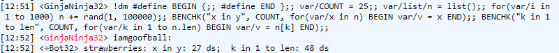

# Coding Requirements

Coders are expected to follow these specifications in order to make everyone's
lives easier. It'll save both your time and ours, by making sure you don't have
to make any changes and we don't have to ask you to.

## Object Oriented Code

As BYOND's Dream Maker (henceforth "DM") is an object-oriented language, code
must be object-oriented when possible in order to be more flexible when adding
content to it. If you don't know what "object-oriented" means, we highly
recommend you do some light research to grasp the basics.

## Use absolute pathing

DM will allow you nest almost any type keyword into a block, as in the following:

```dm
datum
  datum1
    var
      varname1 = 1
      varname2
      static
        varname3
        varname4
    proc
      proc1()
        code
      proc2()
        code

    datum2
      varname1 = 0
      proc
        proc3()
          code
      proc2()
        ..()
        code
```

The use of this format is **not** allowed in this project, as it makes finding
definitions via full text searching next to impossible. The only exception is
the variables of an object may be nested to the object, but must not nest
further.

The previous code made compliant:

```dm
/datum/datum1
    var/varname1 = 1
    var/varname2
    var/static/varname3
    var/static/varname4

/datum/datum1/proc/proc1()
    code

/datum/datum1/proc/proc2()
    code

/datum/datum1/datum2
    varname1 = 0

/datum/datum1/datum2/proc/proc3()
    code

/datum/datum1/datum2/proc2()
    ..()
    code
```

## Do not compare boolean values to `TRUE` or `FALSE`

Do not compare boolean values to `TRUE` or `FALSE`. For `TRUE` you should just
check if there's a value in that address. For `FALSE` you should use the `!`
operator. An exception is made to this when working with JavaScript or other
external languages. If a function/variable can contain more values beyond `null`
or 0 or `TRUE`, use numbers and defines instead of true/false comparisons.

```dm
// Bad
var/thing = pick(TRUE, FALSE)
if(thing == TRUE)
	return "bleh"
var/other_thing = pick(TRUE, FALSE)
if(other_thing == FALSE)
	return "meh"

// Good
var/thing = pick(TRUE, FALSE)
if(thing)
	return "bleh"
var/other_thing = pick(TRUE, FALSE)
if(!other_thing)
	return "meh"
```

## Use `pick(x, y, z)`, not `pick(list(x, y, z))`

`pick()` takes a fixed set of options. Wrapping them in a list is
redundant and slightly less efficient.

```dm
// Bad
var/text = pick(list("test_1", "test_2", "test_3"))
to_chat(world, text)

// Good
var/text = pick("test_1", "test_2", "test_3")
to_chat(world, text)
```

## User Interfaces

All new user interfaces in the game must be created using the TGUI framework.
Documentation can be found inside the [`tgui/docs`][tgui_docs] folder, and the
[`README.md`][tgui_readme] file. This is to ensure all ingame UIs are
snappy and responsive. An exception is made for user interfaces which are
purely for OOC actions (Such as character creation, or anything admin related)

[tgui_docs]: https://github.com/ParadiseSS13/Paradise/tree/master/tgui/docs
[tgui_readme]: https://github.com/ParadiseSS13/Paradise/blob/master/tgui/README.md

## No overriding type safety checks

The use of the [`:`][colon] "runtime search" operator to override type safety
checks is not allowed. Variables must be casted to the proper type.

[colon]: http://www.byond.com/docs/ref/#/operator/:

## Do not chain proc calls and variable access

The use of the pointer operator, `.`, should not be used to access the return
values of functions directly. This can cause unintended behavior and is
difficult to read.

```dm
//Bad
var/our_x = get_turf(thing).x

//Good
var/turf/our_turf = get_turf(thing)
var/our_x = our_turf.x
```

## Type paths must begin with a /

e.g.: `/datum/thing`, not `datum/thing`

## Datum type paths must began with "datum"

In DM, this is optional, but omitting it makes finding definitions harder. To be
specific, you can declare the path `/arbitrary`, but it will still be, in
actuality, `/datum/arbitrary`. Write your code to reflect this.

## Do not use list operators in strings

The use of list operators to augment strings is not allowed. This is roughly 10
times slower than using a list with a Join() Function.

```dm
//Bad
var/text = "text"
text += "More text"
to_chat(world, text)

//Good
var/list/text = list("text")
text += "More text"
to_chat(world, text.Join(""))
```

## Do not use text/string based type paths

It is rarely allowed to put type paths in a text format, as there are no compile
errors if the type path no longer exists. Here is an example:

```dm
//Bad
var/path_type = "/obj/item/baseball_bat"

//Good
var/path_type = /obj/item/baseball_bat
```

## Do not use `\The`

The `\The` macro doesn't actually do anything when used in the format `\The
[atom reference]`. Directly referencing an atom in an embedded string will
automatically prefix `The` or `the` to it as appropriate. As an extension, when
referencing an atom, don't use `[atom.name]`, use `[atom]`. The only exception
to this rule is when dealing with items "belonging" to a mob, in which case you
should use `[mob]'s [atom.name]` to avoid `The` ever forming.

```dm
//Bad
var/atom/A
"\The [A]"

//Good
var/atom/A
"[A]"
```

## Use the pronoun library instead of `\his` macros

We have a system in [`code/__HELPERS/pronouns.dm`][pronouns]
for addressing all forms of pronouns. This is useful in a number of ways;

- BYOND's `\his` macro can be unpredictable on what object it references. Take
  this example: `"[user] waves \his [user.weapon] around, hitting \his
  opponents!"`. This will end up referencing the user's gender in the first
  occurrence, but what about the second? It'll actually print the gender set on
  the weapon he's carrying, which is unintended - and there's no way around
  this.
- It always prints the real `gender` variable of the atom it's referencing. This
  can lead to exposing a mob's gender even when their face is covered, which
  would normally prevent it's gender from being printed.

The way to avoid these problems is to use the pronoun system. Instead of
`"[user] waves \his arms."`, you can do `"[user] waves [user.p_their()] arms."`

```dm
//Bad
"[H] waves \his hands!"
"[user] waves \his [user.weapon] around, hitting \his opponents!"

//Good
"[H] waves [H.p_their()] hands!"
"[user] waves [H.p_their()] [user.weapon] around, hitting [H.p_their()] opponents!"`
```

[pronouns]: https://github.com/ParadiseSS13/Paradise/blob/master/code/__HELPERS/pronouns.dm

## Use `[A.UID()]` over `\ref[A]`

BYOND has a system to pass "soft references" to datums, using the format
`"\ref[datum]"` inside a string. This allows you to find the object just based
off of a text string, which is especially useful when dealing with the bridge
between BYOND code and HTML/JS in UIs. It's resolved back into an object
reference by using `locate("\ref[datum]")` when the code comes back to BYOND.
The issue with this is that `locate()` can return a unexpected datum if the
original datum has been deleted - BYOND recycles the references.

UID's are actually unique; they work off of a global counter and are not
recycled. Each datum has one assigned to it when it's created, which can be
accessed by [`[datum.UID()]`][duid]. You can use this as a snap-in replacement for
`\ref` by changing any `locate(ref)` calls in your code to `locateUID(ref)`.
Usage of this system is mandatory for any `Topic()` calls, and will produce
errors in Dream Daemon if it's not used.

```dm
//Bad
"<a href='byond://?src=\ref[src];'>Link!</a>"

//Good
"<a href='byond://?src=[UID()];'>Link!</a>"
```

[duid]: https://codedocs.paradisestation.org/datum.html#proc/UID

## Use `var/name` format when declaring variables

While DM allows other ways of declaring variables, this one should be used for
consistency.

## Tabs, not spaces

You must use tabs to indent your code, **not spaces**. You may use spaces to align
text, but you should tab to the block level first, then add the remaining
spaces.

## No hacky code

Hacky code, such as adding specific checks (ex: `istype(src, /obj/whatever)`),
is highly discouraged and only allowed when there is **_no_** other option.
(Pro-tip: 'I couldn't immediately think of a proper way so thus there must be no
other option' is not gonna cut it here! If you can't think of anything else, say
that outright and admit that you need help with it. Maintainers, PR Reviewers,
and other contributors who can help you exist for exactly that reason.)

You can avoid hacky code by using object-oriented methodologies, such as
overriding a function (called "procs" in DM) or sectioning code into functions
and then overriding them as required.

The same also applies to bugfixes - If an invalid value is being passed into a
proc from something that shouldn't have that value, don't fix it on the proc
itself, fix it at its origin! (Where feasible)

## No duplicated code

Copying code from one place to another may be suitable for small, short-time
projects, but Paradise is a long-term project and highly discourages this.

Instead you can use object orientation, or simply placing repeated code in a
function, to obey this specification easily.

## Startup/Runtime tradeoffs with lists and the "hidden" init proc

First, read the comments in [this BYOND thread](http://www.byond.com/forum/?post=2086980&page=2#comment19776775), starting where the link takes you.

There are two key points here:

1. Defining a list in the variable's definition calls a hidden proc - init. If
   you have to define a list at startup, do so in `New()` (or preferably
   `Initialize()`) and avoid the overhead of a second call (`init()` and then
   `New()`)

2. It also consumes more memory to the point where the list is actually
   required, even if the object in question may never use it!

Remember: although this tradeoff makes sense in many cases, it doesn't cover
them all. Think carefully about your addition before deciding if you need to use
it.

## Prefer `Initialize()` over `New()` for atoms

Our game controller is pretty good at handling long operations and lag, but it
can't control what happens when the map is loaded, which calls `New()` for all
atoms on the map. If you're creating a new atom, use the `Initialize()` proc to
do what you would normally do in `New()`. This cuts down on the number of proc
calls needed when the world is loaded.

While we normally encourage (and in some cases, even require) bringing out of
date code up to date when you make unrelated changes near the out of date code,
that is not the case for `New()` -> `Initialize()` conversions. These systems
are generally more dependent on parent and children procs, so unrelated random
conversions of existing things can cause bugs that take months to figure out.

## No implicit `var/`

When you declare a parameter in a proc, the `var/` is implicit. Do not include
any implicit `var/` when declaring a variable.

```dm
//Bad
/obj/item/proc1(var/mob/input1, var/input2)
    code

//Good
/obj/item/proc1(mob/input1, input2)
    code
```

## No magic numbers or strings

This means stuff like having a "mode" variable for an object set to "1" or "2"
with no clear indicator of what that means. Make these #defines with a name that
more clearly states what it's for. For instance:

```dm
//Bad
/datum/proc/do_the_thing(thing_to_do)
    switch(thing_to_do)
        if(1)
            do_stuff()
        if(2)
            do_other_stuff()
```

There's no indication of what "1" and "2" mean! Instead, you should do something
like this:

```dm
//Good
#define DO_THE_THING_REALLY_HARD 1
#define DO_THE_THING_EFFICIENTLY 2

/datum/proc/do_the_thing(thing_to_do)
    switch(thing_to_do)
        if(DO_THE_THING_REALLY_HARD)
            do_stuff()
        if(DO_THE_THING_EFFICIENTLY)
            do_other_stuff()
```

This is clearer and enhances readability of your code! Get used to doing it!

## Control statements

- All control statements comparing a variable to a number should use the formula
  of `thing` `operator` `number`, not the reverse (e.g. `if(count <= 10)` not
  `if(10 >= count)`)
- All control statements must be spaced as `if()`, with the brackets touching
  the keyword.
- All control statements must not contain code on the same line as the
  statement.

```dm
//Bad
if(x) return

//Good
if(x)
	return
```

## Player Output

Due to the use of "TGchat", Paradise requires a special syntax for outputting
text messages to players. Instead of `mob << "message"`, you must use
`to_chat(mob, "message")`. Failure to do so will lead to your code not working.

## Use guard clauses

_Guard clauses_ are early returns in a proc for specific conditions. This
is preferred wrapping most of a proc's behavior in an in-block, as procs
will often check a handful of early conditions to bail out on.

This is bad:

```dm
/datum/datum1/proc/proc1()
    if(thing1)
        if(!thing2)
            if(thing3 == 30)
                do stuff
```

This is good:

```dm
/datum/datum1/proc/proc1()
    if(!thing1)
        return
    if(thing2)
        return
    if(thing3 != 30)
        return
    do stuff
```

This prevents nesting levels from getting deeper then they need to be.

## Use `addtimer()` instead of `sleep()` or `spawn()`

If you need to call a proc after a set amount of time, use `addtimer()` instead
of `spawn()` / `sleep()` where feasible. Though more complex, this method has
greater performance. Additionally, unlike `spawn()` or `sleep()`, it can be
cancelled. For more details, see
[https://github.com/tgstation/tgstation/pull/22933](https://github.com/tgstation/tgstation/pull/22933).

Look for code examples on how to properly use it.

```dm
//Bad
/datum/datum1/proc/proc1(target)
	spawn(5 SECONDS)
	target.dothing(arg1, arg2, arg3)

//Good
/datum/datum1/proc/proc1(target)
	addtimer(CALLBACK(target, PROC_REF(dothing), arg1, arg2, arg3), 5 SECONDS)
```

## Signals

Signals are a slightly more advanced topic, but are often useful for attaching
external behavior to objects that should be triggered when a specific event
occurs.

When defining procs that should be called by signals, you must include
`SIGNAL_HANDLER` after the proc header. This ensures that no sleeping code can
be called from within a signal handler, as that can cause problems with the
signal system.

Since callbacks can be connected to many signals with `RegisterSignal`, it can
be difficult to pin down the source that a callback is invoked from. Any new
`SIGNAL_HANDLER` should be followed by a comment listing the signals that the
proc is expected to be invoked for. If there are multiple signals to be handled,
separate them with a `+`.

```dm
/atom/movable/proc/when_moved(atom/movable/A)
	SIGNAL_HANDLER  // COMSIG_MOVABLE_MOVED
	do_something()

/datum/component/foo/proc/on_enter(datum/source, atom/enterer)
	SIGNAL_HANDLER  // COMSIG_ATOM_ENTERED + COMSIG_ATOM_INITIALIZED_ON
	do_something_else()
```

If your proc does have something that needs to sleep (such as a `do_after()`),
do not simply omit the `SIGNAL_HANDLER`. Instead, call the sleeping code with
`INVOKE_ASYNC` from within the signal handling function.

```dm
/atom/movable/proc/when_moved(atom/movable/A)
	SIGNAL_HANDLER  // COMSIG_MOVABLE_MOVED
	INVOKE_ASYNC(src, PROC_REF(thing_that_sleeps), arg1)
```

## Operators

### Spacing of operators

- Operators that should be separated by spaces:
  - Boolean and logic operators like `&&`, `||` `<`, `>`, `==`, etc. (But not `!`)
  - Bitwise AND `&` and OR `|`.
  - Argument separator operators like `,`. (and `;` when used in a forloop)
  - Assignment operators like `=` or `+=` or the like.
  - Math operators like `+`, `-`, `/`, or `*`.
- Operators that should NOT be separated by spaces:
  - Access operators like `.` and `:`.
  - Parentheses `()`.
  - Logical not `!`.

### Use of operators

- Bitwise ANDs (`&`) should be written as `bitfield & bitflag` NEVER `bitflag &
  bitfield`. Both are valid, but the latter is confusing and nonstandard.
- Associated lists declarations must have their key value quoted if it's a string.

```dm
//Bad
list(a = "b")

//Good
list("a" = "b")
```

### Bitflags

Bitshift operators are mandatory, opposed to directly typing out the value:

```dm
#define MACRO_ONE (1<<0)
#define MACRO_TWO (1<<1)
#define MACRO_THREE (1<<2)
```

Is accepted, whereas the following is not:

```dm
#define MACRO_ONE 1
#define MACRO_TWO 2
#define MACRO_THREE 4
```

While it may initially look intimidating, `(1<<x)` is actually very simple and,
as the name implies, shifts the bits of a given binary number over by one digit.

```dm
000100 (4, or (1<<2))
<<
001000 (8, or (1<<3))
```

Using this system makes the code more readable and less prone to error.

## Legacy Code

SS13 has a lot of legacy code that's never been updated. Here are some examples
of common legacy trends which are no longer acceptable:

- To display messages to all mobs that can view `user`, you should use
  `visible_message()`.

```dm
//Bad
for(var/mob/M in viewers(user))
	M.show_message("<span class='warning'>Arbitrary text</span>")

//Good
user.visible_message("<span class='warning'>Arbitrary text</span>")
```

- You should not use color macros (`\red, \blue, \green, \black`) to color text,
  instead, you should use span classes. `<span class='warning'>Red text</span>`,
  `<span class='notice'>Blue text</span>`.

```dm
//Bad
to_chat(user, "\red Red text \black Black text")

//Good
to_chat(user, "<span class='warning'>Red text</span>Black text")
```

- To use variables in strings, you should **never** use the `text()` operator,
  use embedded expressions directly in the string.

```dm
//Bad
to_chat(user, text("[] is leaking []!", name, liquid_type))

//Good
to_chat(user, "[name] is leaking [liquid_type]!")
```

- To reference a variable/proc on the src object, you should **not** use
  `src.var`/`src.proc()`. The `src.` in these cases is implied, so you should
  just use `var`/`proc()`.

```dm
//Bad
var/user = src.interactor
src.fill_reserves(user)

//Good
var/user = interactor
fill_reserves(user)
```

## Develop Secure Code

- Player input must always be escaped safely. We recommend you use
  `stripped_input()` in all cases where you would use input. Essentially, just
  always treat input from players as inherently malicious and design with that
  use case in mind.

- Calls to the database must be escaped properly; use proper parameters (values
  starting with a `:`). You can then replace these with a list of parameters, and
  these will be properly escaped during the query, and prevent any SQL
  injection.

```dm
//Bad
var/datum/db_query/query_watch = SSdbcore.NewQuery("SELECT reason FROM [format_table_name("watch")] WHERE ckey='[target_ckey]'")

//Good
var/datum/db_query/query_watch = SSdbcore.NewQuery("SELECT reason FROM [format_table_name("watch")] WHERE ckey=:target_ckey", list(
	"target_ckey" = target_ckey
)) // Note the use of parameters on the above line and :target_ckey in the query.
```

- All calls to topics must be checked for correctness. Topic href calls can be
  easily faked by clients, so you should ensure that the call is valid for the
  state the item is in. Do not rely on the UI code to provide only valid topic
  calls, because it won't.

- Information that players could use to metagame (that is, to identify round
  information and/or antagonist type via information that would not be available
  to them in character) should be kept as administrator-only.

- Where you have code that can cause large-scale modification and _FUN_, make
  sure you start it out locked behind one of the default admin roles - use
  common sense to determine which role fits the level of damage a function could
  do.

## Files

- Because runtime errors do not give the full path, try to avoid having files
  with the same name across folders.

- File names should not be mixed case, or contain spaces or any character that
  would require escaping in a URI.

- Files and path accessed and referenced by code above simply being `#include`d
  should be strictly lowercase to avoid issues on filesystems where case
  matters.

### Modular Code in a File

- Code should be modular where possible; if you are working on a new addition,
  then strongly consider putting it in its own file unless it makes sense to put
  it with similar ones (e.g. a new tool would go in the `tools.dm` file).

- Our codebase also has support for checking files so that they only contain one
  specific typepath, including none of its subtypes. This can be done by adding
  a specific header at the beginning of the file, which the CI will look for
  when running. An example can be seen below. You can also run this test locally
  using `/tools/ci/restrict_file_types.py`

```dm
RESTRICT_TYPE(/datum/foo)

/datum/proc/do_thing() // Error: '/datum' proc found in a file restricted to '/datum/foo'

/datum/foo

/datum/foo/do_thing()

/datum/foo/bar // Error: '/datum/foo/bar' type definition found in a file restricted to '/datum/foo'

/datum/foo/bar/do_thing() // Error: '/datum/foo/bar' proc found in a file restricted to '/datum/foo'
```

## SQL

- Do not use the shorthand SQL insert format (where no column names are
  specified) because it unnecessarily breaks all queries on minor column changes
  and prevents using these tables for tracking outside related info such as in a
  connected site/forum.

- Use parameters for queries, as mentioned above in [Develop Secure Code](#develop-secure-code).

- Always check your queries for success with `if(!query.warn_execute())`. By
  using this standard format, you can ensure the correct log messages are used.

- Always `qdel()` your queries after you are done with them. This cleans up the
  results and helps things run smoother.

- All changes to the database's layout (schema) must be specified in the
  database changelog in SQL, as well as reflected in the schema file.

- Any time the schema is changed, the `SQL_VERSION` defines must be incremented,
  as well as the example config, with an appropriate conversion kit placed in
  the `SQL/updates` folder.

- Queries must never specify the database, be it in code, or in text files in
  the repo.

## Dream Maker Quirks/Tricks

Like all languages, Dream Maker has its quirks and some of them are beneficial
to us.

### In-To for-loops

`for(var/i = 1, i <= some_value, i++)` is a fairly standard way to write an
incremental for loop in most languages (especially those in the C family), but
DM's `for(var/i in 1 to some_value)` syntax is oddly faster than its
implementation of the former syntax; where possible, it's advised to use DM's
syntax. (Note, the `to` keyword is inclusive, so it automatically defaults to
replacing `<=`; if you want `<` then you should write it as `1 to
some_value-1`).

**However**, if either `some_value` or `i` changes within the body of the for
(underneath the `for(...)` header) or if you are looping over a list **and**
changing the length of the list, then you can **not** use this type of for-loop!

### `for(var/A in list)` VS `for(var/i in 1 to length(list))`

The former is faster than the latter, as shown by the following profile results:



Code used for the test:

```dm
var/list/numbers_to_use = list()
proc/initialize_shit()
	for(var/i in 1 to 1000000)
		numbers_to_use += rand(1,100000)

proc/old_loop_method()
	for(var/i in numbers_to_use)
		var/numvar = i

proc/new_loop_method()
	for(var/i in 1 to numbers_to_use.len)
		var/numvar = numbers_to_use[i]
```

### `istype()`-less `for` loops

A name for a differing syntax for writing for-each style loops in DM. It's **not**
DM's standard syntax, hence why this is considered a quirk. Take a look at this:

```dm
var/list/bag_of_items = list(sword1, apple, coinpouch, sword2, sword3)
var/obj/item/sword/best_sword
for(var/obj/item/sword/S in bag_of_items)
	if(!best_sword || S.damage > best_sword.damage)
		best_sword = S
```

The above is a simple proc for checking all swords in a container and returning
the one with the highest damage, and it uses DM's standard syntax for a for-loop
by specifying a type in the variable of the for's header that DM interprets as a
type to filter by. It performs this filter using `istype()` (or some
internal-magic similar to `istype()` - this is BYOND, after all). This is fine
in its current state for `bag_of_items`, but if `bag_of_items` contained ONLY
swords, or only SUBTYPES of swords, then the above is inefficient. For example:

```dm
var/list/bag_of_swords = list(sword1, sword2, sword3, sword4)
var/obj/item/sword/best_sword
for(var/obj/item/sword/S in bag_of_swords)
	if(!best_sword || S.damage > best_sword.damage)
		best_sword = S
```

The above code specifies a type for DM to filter by.

With the previous example that's perfectly fine, we only want swords, but if the
bag only contains swords? Is DM still going to try to filter because we gave it
a type to filter by? YES, and here comes the inefficiency. Wherever a list (or
other container, such as an atom (in which case you're technically accessing
their special contents list, but that's irrelevant)) contains datums of the same
datatype or subtypes of the datatype you require for your loop's body, you can
circumvent DM's filtering and automatic `istype()` checks by writing the loop as
such:

```dm
var/list/bag_of_swords = list(sword, sword, sword, sword)
var/obj/item/sword/best_sword
for(var/s in bag_of_swords)
	var/obj/item/sword/S = s
	if(!best_sword || S.damage > best_sword.damage)
		best_sword = S
```

Of course, if the list contains data of a mixed type, then the above
optimisation is **dangerous**, as it will blindly typecast all data in the list
as the specified type, even if it isn't really that type, causing runtime errors
(aka your shit won't work if this happens).

### Dot variable

Like other languages in the C family, DM has a `.` or "Dot" operator, used for
accessing variables/members/functions of an object instance. eg:

```dm
var/mob/living/carbon/human/H = YOU_THE_READER
H.gib()
```

However, DM also has a dot _variable_, accessed just as `.` on its own,
defaulting to a value of null. Now, what's special about the dot operator is
that it is automatically returned (as in the `return` statement) at the end of a
proc, provided the proc does not already manually return (`return count` for
example.) Why is this special?

With `.` being everpresent in every proc, can we use it as a temporary variable?
Of course we can! However, the `.` operator cannot replace a typecasted variable
- it can hold data any other var in DM can, it just can't be accessed as one,
although the `.` operator is compatible with a few operators that look weird but
work perfectly fine, such as: `.++` for incrementing `.'s` value, or `.[1]` for
accessing the first element of `.`, provided that it's a list.

### Globals versus static

DM has a var keyword, called `global`. This var keyword is for vars inside of
types. For instance:

```dm
/mob
	var/global/thing = TRUE
```

This does **not** mean that you can access it everywhere like a global var. Instead, it means that that var will only exist once for all instances of its type, in this case that var will only exist once for all mobs - it's shared across everything in its type. (Much more like the keyword `static` in other languages like PHP/C++/C#/Java)

Isn't that confusing?

There is also an undocumented keyword called `static` that has the same
behaviour as global but more correctly describes BYOND's behaviour. Therefore,
we always use static instead of global where we need it, as it reduces suprise
when reading BYOND code.

### Global Vars

All new global vars must use the defines in
[`code/__DEFINES/_globals.dm`][globals]. Basic usage is as follows:

To declare a global var:

```dm
GLOBAL_VAR(my_global_here)
```

To access it:

```dm
GLOB.my_global_here = X
```

There are a few other defines that do other things. `GLOBAL_REAL` shouldn't be
used unless you know exactly what you're doing. `GLOBAL_VAR_INIT` allows you to
set an initial value on the var, like `GLOBAL_VAR_INIT(number_one, 1)`.
`GLOBAL_LIST_INIT` allows you to define a list global var with an initial value,
etc.

[globals]: https://github.com/ParadiseSS13/Paradise/blob/master/code/__DEFINES/_globals.dm
