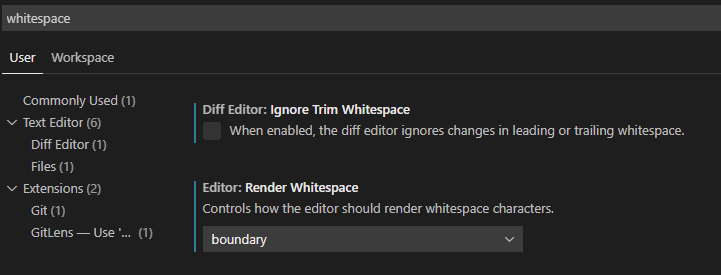

# Code Contribution Quickstart

by *Farie82*

## Intro
Glad you're reading this and hopefully this guide will help you start
contributing to this codebase! First a word of wisdom. Start small with your
first set of PRs even if you are already experienced with developing for other
languages or codebases. Every codebase has its own quirks and standards which
you will discover by doing and receiving feedback on your work. This guide will
help you set up your git and make your first PR. It will also include some tips
on how to (in my opinion) best handle the codebase. This guide will assume that
you have at least (very) minor knowledge of how programming works. Knowing what
a `string` is and how `if` statements work for example. The guide will also
assume that you will use VS Code which the [Getting
Started](../contributing/getting_started.md) guide helps you set up.

Be sure to also take a look at the [contributing page](../CONTRIBUTING.md) so
you know what the coding standards are here.

I've also made a [debugging tutorial](./debugging.md) which will help you find
the cause of bugs and how to fix them.

## Quick DM tutorial
For your first PR you won't need an in-depth knowledge of how to code in DM, but
here are some of the basics. Feel free to skip these and come back to this once
you feel like you are missing some info.

The [DM reference guide](http://www.byond.com/docs/ref/) is also great when you
want to look up how a proc or such works. VS Code does have a build-in reference
guide for you to use as well. Just `Ctrl`-click on any BYOND proc or variable to
see the reference on it.

### Objects and Inheritance
An object is defined the following way:
```dm
/obj/item/multitool
```

Here we can see a `multitool` being defined. A `multitool` is an `item` which is
an `obj`. This is how the class inheritance works for DM. A real-life example is
that a dog is an animal and a cat is an animal. But a dog is not a cat. In DM it
could look something like this:

```dm
/mob/animal/cat
	name = "Cat"

/mob/animal/dog
	name = "Dog"
```

Where `mob` is a being in DM. Thus something that "lives" and can do things.

### Procs
The way DM groups a set of instructions is as follows. It uses a *proc* or in
other languages also called a method or function.

```dm
/obj/item/pen/multi/proc/select_colour(mob/user)
	var/newcolour = input(user, "Which colour would you like to use?", name, colour) as null|anything in colour_choices
	if(newcolour)
		colour = newcolour
		playsound(loc, 'sound/effects/pop.ogg', 50, 1)
		update_icon()
```

`/obj/item/pen/multi/proc/select_colour` here is the proc definition. Meaning
this is the first instance of this proc. For this, you need to add `proc/` in
front of the method name (`select_colour` in this case). `mob/user` is here a
parameter given to the proc. The name of the parameter is `user` and its type is
`mob`.

As with other languages you can also override the behaviour of a proc.

```dm
/obj/item/pen/multi/attack_self(mob/living/user)
	select_colour(user)
```

Here the proc `attack_self` is overridden with new behaviour. It will call
`select_colour` with as a parameter the given `user`.

#### Overriding Procs

When overriding a proc you can also call the parent's implementation. This is
especially handy when you want to extend the existing behaviour with new
behaviour.

```dm
/obj/item/pen/multi/Initialize(mapload)
	. = ..()
	update_icon()
```

Here `Initialize` is overridden with `mapload` as a parameter. `..()` means call
the parent implementation of this proc with the parameters given to this
version. So `mapload` will be passed through. `. = ..()` means assign the value
that the parent's version returns as our default return value. `.` is the
default return value in DM. So if you don't return an explicit value at the end
of the proc then `.` will be returned.

```dm
/proc/test()
	. = "Yes"
	return "No"
```

This will return `"No"` since you explicitly state to return `"No"`.

Small tip. You can also `Ctrl`-click on `..()` to go to the parent's definition.

### Putting values easily in strings

Other languages use something like `string.format("{0} says {1}", mob_name,
say_text)`. But DM has something nifty for that. The same result can be achieved
in DM using the following:

```dm
"[mob_name] says [say_text]"
```

`[...]` will run the code and return the outcome inside the `[]`. In the case
above it will just return the value of the variables but you can also use logic
here.

```dm
var/val = 1
world.log << "val is [val]. val plus 10 is: [val + 10]"
```

Which will produce `"val is 1. val plus 10 is: 11"`

### Scoping
If you come from another language then you might think. "Hey, where are the
{}'s?!". Well, we do not use those (usually). Instead scoping is done by
whitespace. Tabs in our case. One tab means one scope deeper.

```dm
/mob
	name = "Thing"

/mob/proc/test()
	world.log << name // We can access name here since we are in the mob
	if(name == "Thing")
		var/value = 10
		world.log << "[value]" // We can also access value here since it is in the same scope or higher as us.
		world.log << "Will only happen if name is Thing"
	else
		world.log << "Will only happen if name is not Thing"
	world.log << "Will always happen even if name is not Thing"
	world.log << "[value]" // This will produce an error since value is not defined in our current scope or higher
```

In VS Code you can make your life easier by turning on the rendering of
whitespace. Go to the settings and search for whitespace.



I have set it up so that I can only see the boundary whitespace. Meaning that I
visually see spaces and tabs on the outmost left and right side of a line. Very
handy in spotting indentation errors.

### Deleting stuff

DM has a build-in proc called `del`. **DO NOT USE THIS**. `del` is very slow and
gives us no control over properly destroying the object. Instead, most/all SS13
codebases have made their own version for this. `qdel` which will queue a delete
for a given item. You should always call `qdel` when deleting an object. This
will not only be better performance-wise but it will also ensure that other
objects get notified about its deletion if needed.

### Coding Standards

**Before you start coding it is best to read our** [contributing page](../CONTRIBUTING.md).
It contains all of the coding standards and some tips and tricks on how to write
good and safe code.

### Terminology
We will be using some terminology moving forward you should be comfortable with:

- [PR](../references/glossary.md#pull-request), an abbreviation for pull
  request. This is the thing that will get your changes into the actual game. In
  short, it will say you request certain changes to be approved and merged into
  the master branch. Which is then used to run the actual game.

- [VS Code](../references/glossary.md#vsc), short for Visual Studio Code. The
  place where you do all your magic. It is both a text editor with a lot of
  helpful tools and a place where you can run and debug your code.

- Scoping; defining what code belongs to what. You don't want to make everything
  public to the whole codebase so you use scoping. See the explanation above for
  more info.

- Feature branch; the branch where your new feature or fix is located on. Git
  works with branches. Each branch containing a different version of the
  codebase. When making a PR git will look at the differences between your
  branch and the master branch.

## Setup
Code contributions require setting up a development environment. If you haven't
done that already, follow the guide at [Getting Started](../contributing/getting_started.md)
first.

## Your First PR
Once you've completed the setup you can continue with making an actual PR.

I'd suggest keeping it small since setting up all of the git stuff was already a
task of its own. My suggestion would be to look at issues with the [Good First
Issue][gfi] label. These usually are considered to be easy to solve. Usually,
they will also contain some comments containing hints on how to solve them. When
picking one be sure that you do not pick an issue that already has an open PR
attached to it like in the picture below.


You *can* make a PR that solves that issue. But it would be a waste of time
since somebody else already solved it before you but their PR is still awaiting
approval.

If there are no suitable good first issues then you can look through the issue
list yourself to find some. Good ones include typos or small logic errors. If
you know of any issues that are not yet listed in the issues list then those are
also fine candidates.

Alternatively, you can implement a small new feature or change. Good examples
include:

- More or changed flavour text to an item/ability etc.
- Adding (existing) sound effects to abilities/actions.
- Adding administrative logging where it is missing. For example, a martial arts
  combo not being logged.
- A new set of clothing or a simple item.

There of course are many more options that are not included in this list.

[gfi]: https://github.com/ParadiseSS13/Paradise/labels/Good%20First%20Issue

### Finding The Relevant Code
The first thing you will need to do is to find the relevant code once you
figured out what you want to add/change. This is no exact science and requires
some creative thinking but I will list a few methods I use myself when finding
code.

For all of these, you will need to have VS code open and use the search
functionality. I tend to only look for things in dm files. Which are the code
files.


#### Finding Existing Items
If you're looking for an existing item then it might be easiest to look for the
name of the item. Let's take a multitool as an example here.

When looking for the term `multitool` you will tend to find a lot of results.
305 results on my current version of the game in fact.


Alternatively, you can search for `"multitool"` (the string with the value
`multitool`) and find a lot fewer results. For demonstration purposes, I will
exclude the `""` here. This will give you the following match:


This might seem like a lot (and it is) but you don't have to go through them all
to find the item itself. Using some deduction we can find the result we need. Or
find it via another result we found. Here we can see that there are some matches
with `obj/item/multitool` for example:


We know that we are looking for a multitool and that a multitool is an item so
it looks like this is what we want to find. When hovering over the `multitool`
part of `obj/item/multitool` and holding the `Ctrl` key you will see the
definition of the object.


Perfect! This is the one we need. How how do we get to that definition? Simple
you click on `multitool` when holding `Ctrl`. This will send you to the definition
of the object.

Most of the times the file containing the definition will also include the
looked for proc or value you want to change.

#### Finding Behaviour
This is a very wide concept and thus hard to exactly find.

For this, we will use the above method and use keywords explaining the behaviour
you want to search. For example a mob gibbing. Simply looking for `gib` here
will find us too many results. About 1073 in my case. Instead, we will try to
look for a proc named gib. `/gib(` will be used as our search criteria here.


Et voila, just 15 results.

Say we want to delete the pet collar of animals such as Ian when he is gibbed.
Here we need to find something stating that the `gib` belongs to an animal.


`/mob/living/simple_animal/gib()` is what we are looking for here. Ian is an
animal. `simple_animal` in code.

This will find us the following code (on my current branch):

```dm
/mob/living/simple_animal/gib()
	if(icon_gib)
		flick(icon_gib, src)
	if(butcher_results)
		var/atom/Tsec = drop_location()
		for(var/path in butcher_results)
			for(var/i in 1 to butcher_results[path])
				new path(Tsec)
	if(pcollar)
		pcollar.forceMove(drop_location())
		pcollar = null
	..()
```

The behaviour we're looking for here has to do with the `pcollar` code there. It
will currently move the attached pet collar (if any) to the drop location of the
animal when they are gibbed.

#### Finding A Suitable Place To Add A New Item
When adding a new item you want to ensure that it is placed in a logical file or
that you make a new file in a logical directory. I find that it is best to find
other similar items and see how they are defined. For example a special jumpsuit
without armour values. Here we first go look for the existing non-job-related
jumpsuits such as the `"mailman's jumpsuit"`. Say we don't know the exact name
of that jumpsuit but we do know that it is for a mailman.

Our best bet will be to look for the term `mailman` and see what pops up. This
is a rather uncommon term so it should give only a few results.


Perfect. Even the item definition has the name mailman in it.

We already see from the search results that the item is defined in the
`miscellaneous.dm` file. Navigating to it will show us the directory it is in.


As you can see most clothing items are defined in this `clothing` directory.
Depending on your to add the item you can pick one of those files and see if it
would fit in there. Feel free to ask for advice from others if you are unsure.

### Solving The Actual Issue
Now comes the **Fun** part. How to achieve what you want to achieve? The answer
is. "That depends" Fun, isn't it? Every problem has its own way of solving it. I
will list some of the more common solutions to a problem down here. This list
will of course not be complete.

A great hotkey for building your code quick is `Ctrl` + `Shift` + `B`. Then press enter to
select to build via Byond. This will start building your code in the console at
the bottom of your screen (by default). It will also show any errors in the
build process.


Here I have "accidentally" placed some text where it should not belong. Going to
the "Problems" tab and clicking on the error will bring you to where it goes
wrong.


This error does not tell much on its own (Byond is not great at telling you what
goes wrong sometimes) but going to the location shows the problem quite easily.


More cases might be added later.

#### Typo Or Grammar
The easiest of them all if you can properly speak English. Say the multitool
description text is: `"Used for pusling wires to test which to cut. Not
recommended by doctors."` Then you can easily fix the typo ("pusling" to
"pulsing") by just changing the value of the string to the correct spelling.

#### Wrong Logic
This one really depends on the context. But let us take the following example.
You cannot link machinery using a multitool. Something it should do.

```dm
/obj/item/multitool/proc/set_multitool_buffer(mob/user, obj/machinery/M)
	if(ismachinery(M))
		to_chat(user, "<span class='warning'>That's not a machine!</span>")
		return
```

Here a simple mistake is made. A `!` is forgotten. `!` will negate the outcome
of any given value. In this case, a check to see if `M` is indeed a piece of
machinery. This seems dumb to forget or do wrong but it can happen when a large
PR gets made and is changed often. Testing every case is difficult and cases can
slip under the radar.

#### Adding A New Item

You can start defining the new item once you found the proper file the item
should belong to. Depending on the item you will have to write different code
(duh). We will take the new jumpsuit as an example again and will put it in the
`misc_jumpsuits` file.

When defining a new jumpsuit you can easily copy an existing one and change the
definition values. We will take the mailman outfit as a template.

```dm
/obj/item/clothing/under/misc/mailman
	name = "mailman's jumpsuit"
	desc = "<i>'Special delivery!'</i>"
	icon_state = "mailman"
	inhand_icon_state = "b_suit"
```

As seen here a jumpsuit has multiple values you can define. The `name` is pretty
straight forward. `desc` is the description of the item. `icon_state` is the name
the sprite has in the `icon` DMI file. `inhand_icon_state` is the name of the
sprite of the suit while held in your hands has in the `lefthand_file` and
`righthand_file` DMI files. You will also have to add worn icon state (when it's
equipped on a mob) to the `worn_icon` DMI file, or, if it's not set, to the
`icons/mob/clothing/under/misc.dmi`.

We of course also have to change the path of the newly created object. We'll
name it `/obj/item/clothing/under/misc/tutorial`. This alone will make it so
that you can spawn the item using admin powers. It will not automagically appear
in vendors or such.

### Testing Your Code
Once you are done coding you can start testing your code, assuming your code compiles of course.

To do this simply press `F5` on your keyboard. This will by default build your
code and start the game with a debugger attached. This allows you to debug the
code in more detail.

Later I will include a more detailed testing plan in this guide.

### Making The PR
Once you are done with your changes you can make a new PR.

New PRs must be created on _branches_. Branches are copies of the `master`
branch that constitutes the server codebase. Making a separate branch for each
PR ensures your `master` branch remains clean and can pull in changes from
upstream easily.


Select "Create new branch" and then give your new branch a name in the top text
bar in VS code. Press enter once you are done and you will have created a new
branch. Your saved changes will be carried over to the new branch.


You are ready to commit the changes once you are on your feature branch and when
the code is done and tested. Simply write a (short) useful commit message
explaining what you've done. For example when implementing the pet collar
gibbing example


Here you can also see the changes you have made. Clicking on a file will show
you the difference between how it was before and how it is now. When you are
happy with the existing changes you can press the commit button. The checkmark.
By default it will commit all the changes there are unless you staged changes.
Then it will only commit the staged changes. Handy when you want to commit some
code while you have some experimental code still there.

Once it is committed you will have to also publish the branch.


When pressing push it will ask you if you want to publish the branch since there
is no known remote version of this yet (not on Github). Say yes to that and
select "origin" from the list of available remotes. Now your code is safely
pushed to Github.

Now go to the Github page of this codebase and you will see the following:


Click on the green button and Github will auto-create a PR template for you for
the branch you just pushed. Be sure to fill in the template shown to you. It is
quite straight forward but it is important to note down the thing you changed in
enough detail. If you fixed an issue then you can write the following `fixes #12345`
where 12345 is the number of the issue. Put this line of text in the
*What Does This PR Do* part of the PR.

You can submit it once you are happy with how the PR looks. After this, your PR
will be made public and visible to others to review. In due time a maintainer
will look at your PR and will merge it if it is deemed an addition to the
codebase.

## Tips And Tricks
Here I will list some of my tips and tricks that can be useful for you when
developing our codebase.

- Sounds like a simple and logical one. But always feel free to ask others for
  help/advice. This project is an open-source project run by a lot of passionate
  people who want to improve the codebase together. Asking for help/advice will
  not only help you get your code running but will also show you are interested
  and will help you improve your skills.

- Learn the VS Code shortcuts. This really saves you a lot of time. `Ctrl` + `Shift` + `B`
  will build your project. `F5` will run it in debug mode. `Ctrl` + `Shift` + `F`
  will global search. `Ctrl` + `P` will find definitions of things (super handy).

- Use find references when right-clicking on a variable or proc. This will list
  all the uses of this var/proc so you can see what it is actually used for or
  where you need to change things as well etc.

- You can remove the build command from F5. This saves you some time when you
  develop. Be sure to manually build your code though! This can be done by
  removing the `preLaunchTask` line in the debug config:


