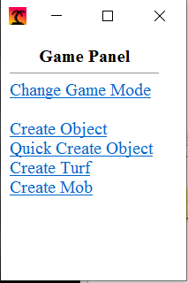
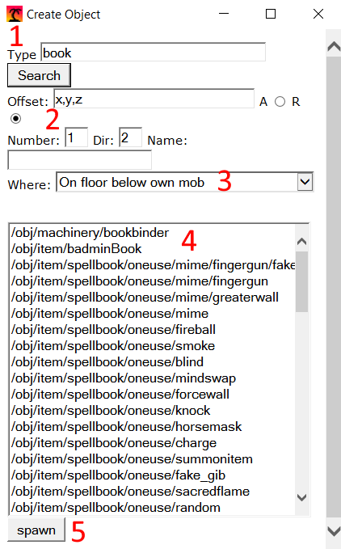
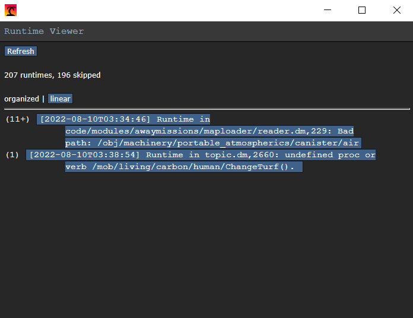
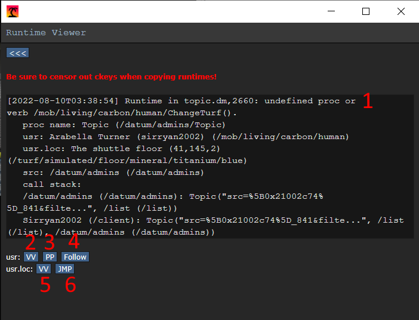

# Guide to Testing

Code by nature works *as coded* and not always *as intended*, while you
know that your code compiles and passes tests on your Pull Request you
may not know if it breaks in edge cases or works fully in-game. In order
to ensure your changes actually work, you will need to know how to
**Test Your Code**. As part of this process, you will learn how to use
various in-game debugging tools to fully utilize your changes in a test
server, analyse variables at run-time, test for edge cases, and stress
test features. This guide will also explain more advanced concepts and
testing such as advanced proc calls, garbage collection testing, and
breakpoints.

## Prerequisites

-   You will need to first [set up your development environment][setup] and
    successfully launch a local server.
-   Give yourself host-level permissions on your local server (You should have
    access to every verb and tab available in-game).
-   Have an open and patient mindset.
-   Approach the QA process as if you're asking yourself questions and
    answering them by performing successful (or unsuccessful) tests.

[setup]: ../contributing/getting_started.md

### Prep Work

In order to speed this up, especially for experienced devs, know what
you're looking for and write down a list (mental lists work as well) of
what you want to test. If you're only changing an attribute, list the
interactions that attribute has with other functions so you remember to
test each one. If you're adding a new atom, write down possible
interactions that atom may have with other relevant atoms (think parent
objects, tools, materials, machinery such as autholathes, antagonists).

Make your tests atomic. i.e. don't try and test everything at once,
pick one specific thing (or closely related groups of things) to test
on. If your item affects other items you want to test, consider
restarting and using a clean round or properly cleaning up the test
area.

### Basic In-Game Tools

While mastery of these tools is not required, basic familiarity with
them will be paramount to proper testing.

#### Game Panel

The Game Panel is a small menu that allows the user to set the game mode
for the round or spawn in atoms (turfs, objects, mobs, etc). In order to
access the Game Panel, you will need to click the *Game Panel* verb
under the admin tab.

The Game panel has five buttons:

1. **Change Gamemode** will allow the user to set the round game mode. This is
   only binding if the round has not started yet.

2. **Create Object** allows the user to spawn in any object. The search bar will
   return all type paths relevant to the search given.

3. **Quick Create Object** allows the user to search for objects in a more
   specific scope (only guns, only mechs, etc).

4. **Create Turf** allows the user to change the turf they are directly over.

5. **Create Mob** allows the user to spawn in a mob.

The most important buttons are the four create buttons. By clicking on them you
can open up the game panel create menu. For beginners, there are five important
aspects of the game panel that you will need to know (the other inputs and
buttons are very sparsely used, and likely not needed in your case).

1.  The type path to search for, this input will tell the panel to query
    for any typepath that contains the given string, so if you searched
    for "book" it would return type paths such as
    "machinery/bookBinder", "spellbook/mime/oneuse", or
    "book/codex_gigas". Keep in mind this will return *all* type paths
    with the given string, since the game panel is tied to your client
    CPU usage, trying to search type paths with a query such as "item"
    or "mob" will return thousands of results and likely freeze your
    client for some time or crash it.
2.  The number or amount of the element you want to spawn, if you were
    spawning a book and typed in three, it would spawn three books.
3.  Where this object will spawn, generally you will want the default
    "On the floor below mob" or if you're a human, "in own mob's
    hands". If you're specifically trying to spawn the element inside
    another object, you can mark the object and use that option.
4.  The list of type paths to select, you will need to click the
    typepath to select it. Alternatively, if you want to spawn in
    multiple types at once, you can click-drag up to 5 type paths and
    spawn them all at once.
5.  The button that spawns stuff with the parameters you gave the panel.

#### Runtime Viewer

The runtime viewer interface is a menu that displays every runtime that
occurred during the current round. It is available by clicking the *View
Runtimes* verb under the "Debug" tab.

The runtime viewer displays a list of *almost* every runtime in a round, a few
unimportant or repeated runtimes are skipped. Essentially, runtimes are errors
that occur when the server is running (as compared to a build error that occurs
when attempting to compile). Clicking on a runtime will open up more details
about it.

1.  The runtime error. This will generally include information about the
    type of error (null reference, bad proc calls, etc), what file it
    occurred in, what line it occurred at, and information about the
    proc it occurred in. Some errors will also include "call stacks"
    or the procs called leading up to the error.
2.  user VV button, will open the view variables panel on the mob that
    caused the runtime
3.  user PP button, will open the player panel on the mob that caused
    the runtime
4.  user follow button, will force the user to follow/orbit the mob that
    caused the runtime
5.  loc VV button, will open the view variables panel on the loc (turf
    or thing that contains the object) of the object that caused the
    runtime
6.  loc jump button, will force the user to jump to the loc where the
    runtime occurred.

## Does it Even Work?

The first step in testing is to see if your change spawns in/displays
*at all*. This part of testing focuses solely on finding out when and
where your changes break, not particularly how or why it breaks.

If your change is creation/removal of an atom. open up the [Game Panel](#game-panel)
and see if the atom has been added/removed as a typepath. If it's not, make sure
your code was actually compiled and check to either see if you:

- actually defined a new typepath properly and have the file ticked in the DME
  file, and
- you removed ALL instances where the type path is used (even proc
  definitions!).

If your change is a map change, please see the [Mapping Requirements](../mapping/requirements.md).

Use the game panel to spawn your atom with the given type path. Ensure the following:

- Does it appear?
- Is the sprite correct?
- Is the name/appearance/description of the atom correct?

_Note:_ An Atom in DM refers to all elements of type "area", "turf", "object",
or "mob." Each has different behaviors for spawning, deletion, and interaction,
so keep that in mind. Additionally, there will not be much reference/relevance
in this section to "Area" type atoms.

### Does it Work the Way You Want it to?

Test the attributes of your atom:

- If it has health, can you kill or break it?
- If it has a menu, can you open up and interact with the UI correctly, can you
  press buttons?
- If you added a special feature, can you activate it correctly?
- Does your new turf have proper atmospherics?

You may not have touched a certain section of code, but it's entirely
possible that you broke it with a nearby change, check to make sure it
still works the way it's supposed to (or even at all). For example, if
you modified a variable inside a book object, can the barcode scanner
still scan it into the library system? If you changed the way xenomorphs
handle combat, will disablers, lasers, batons, etc still work the same
way or function at all?

### Be Concise and Specific

Your goal here is to break your change in every (relevant) way possible,
use your change in every way you intended it to be used and then use it
every way it wasn't intended to be used. However, this isn't to say
you need to test every use case or test every single object that may be
affected. As a contributor, you have limited time in your day to spend
on coding, don't waste all of it trying out every different testing
scenario. Here are a few tips to be efficient:

- Know the code so that you know what other objects or parts of a feature will
  be affected, then you have a mental list of things that need to be tested.
- Focus on testing one feature at a time, especially ones that you're focused on
  coding at the moment; This keeps your attention scoped to that feature so you
  can quickly make the needed changes and move on (this will help avoid
  "*scope-creep*.")
- If your feature is built on another feature working (i.e. your feature working
  *depends* completely on another feature working properly), test the dependency
  if your feature is breaking to ensure the point of failure isn't just a
  dependency breaking.

## Why Doesn't it Work?

The previous question of "does it work" often answers itself just by
spooling up a test environment, however, figuring out why things break
is a much more difficult and in-depth task. This section will avoid
getting into technical discussion and will instead explore conceptually
how to begin understanding why your change is not working.

### Does it Produce Errors?

Changes that clearly break often come saddled with a few *runtimes* which are
errors that occur while the server is actively running. In your preferences tab,
you can click the *Toggle Debug Log Messages* verb to toggle on debug message
which will allow you to see runtimes pop up exactly when they happen in the chat
box. You will need to do this every round unless you have a database properly
set up. Additionally, you can view all runtimes in a round by clicking the
[*View Runtimes*](#runtime-viewer) verb in the debug tab to open up the runtime
viewer.

This will allow you to identify the errors your changes are producing
and possibly even identify where, how, and what is breaking in your
code. Do note that this will often not reveal larger issues with your
code that is sourced from bad design decisions or unintentional effects.

## TODOs

Further sections are forthcoming, including assertion checking.
