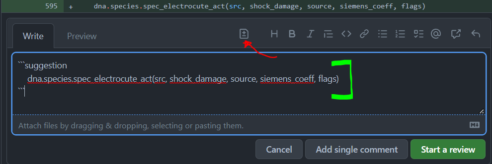

# Reviewer Crash Course

by _Sirryan_

Hey everyone, I noticed some people were not sure how to approach reviewing PRs
so I figured I would write up a small guide on PR reviewing and how people like
our Headcoders, maintainers, Lewcc, S34N, and I all do our jobs. In addition
to some guidance and pointers on PR reviewing, I will also go over a few code
examples and point out code standard corrections and basic errors that
prospective reviewers can begin to start on.

## What is code review?

> Code reviews act as quality assurance of the code base.... _and_ can also act
> as a second step in identifying bugs, logic problems, or uncovered edge cases.
> [(source)](https://about.gitlab.com/topics/version-control/what-is-code-review/)

This is a quote from a gitlab article on the importance of code reviews and code
reviewer teams. It refers to code reviews as a process in which code is
scrutinized (often by more experienced developers); In this process bugs, bad
logic, and unforeseen consequences of changes are uncovered and identified. This
implies that some code will not be high quality, it will have bugs, the logic
used may be illogical, and the actual execution of the code may produce results
not originally intended by the author. By addressing these quality issues in
review, we can eliminate security issues, increase collaboration, discover bugs
earlier, share knowledge, enforce code standards, and ultimately improve our
game.

Understanding code review first comes from understanding what a pull request is
and the process contributors go through to add their code to the Paradise
Station codebase. When a community member wants to alter the game in some
format, be it a feature, backend processes, or artistic style, they must modify
our game code in some fashion. They will often do this through services such as
visual studio code, GitHub desktop, gitkraken, tortoisegit, etc. Eventually they
will be ready to request that our repository owners merge their new changes into
the codebase. This is a pull request.

This is the point where code review comes in. The author's code is now publicly
visible and therefor available for anyone with an account to review. If you have
closely followed any PR that changed code in a significant way, you will see
that many people will chip in with their opinion or "comment" on code snippets.


This is the most basic form of review. Most people may understand "code review"
as developers suggesting changes to the authors proposed changes or providing
critical review of a code structure; Ultimately, review is just a conversation
between two developers. Feedback, questions, and advice are all **valid and
necessary** parts of the code review as much as a code suggestion or comment may
be. In fact, it may be even more important than suggesting the author change a
`src.loc` to a `loc`. Questions such as "What does X do?" or "I know that Y has
done this before, what happens when Z?" ask the author to take a closer look at
their own code and help you understand their intention and goals. Please note:
ITS IMPORTANT TO READ PR DESCRIPTIONS, you should not be reviewing a PR until
you know what it's actually attempting to do.

**But Sirryan, that's not the _kind_ of code review I'm interested in learning
about**. Yes, yes, I know, I'm getting there. While its important to understand
the conversation (and relationship-building) parts of code review, there's also
important technical parts to review that keep our codebase moving. Before
getting into HOW to code review, we will take a look at the two types of
technical code reviews.

## Comments

Basic comments are when a reviewer leaves a message, question, or directive for
the PR author at a certain code line or chunk. For example, SteelSlayer has left
a comment on Line 12 of `objective.dm` inquiring about a certain variable. The
focus of this conversation here is on this one comment and there is room for the
author (and possibly other reviewers) to enter the discussion. Commenting on
specific places on code helps keep the conversation focused and allows minor
issues to be addressed quickly and efficiently.


## Suggestions

Suggestions are when a reviewer suggests/requests a change to a certain line or
chunk of code. This leaves less agency for the PR author (especially when
suggested by a development team member or experienced reviewer) but allows for
the issue to be cleared up much more quickly and with only the click of a couple
buttons. In this case, I have physically wrote out the code I would like to
change this line to, in this case I want `if(contents.len>=max_n_of_items)`
changed to `if(length(contents) >= max_n_of_items)`. These types of reviews are
most critical for enforcing code standards and making 1-5 line corrections.


## Leaving PR Reviews

The way you leave any form of comment or suggestion directly on a line or chunk
of code is under the "Files Changed" tab of the pull request. All you need to do
now is scroll down to a line of code that you want to comment on and hover over
it, a blue plus button will appear and you can click on it to open a comment
menu.


You can leave feedback, ask questions, whatever. If you want to suggest changes
to the code, you will need to click the code review icon on the text tool bar.
This will automatically populate a suggestion template in your comment,
everything inside the triple tildes will be part of the suggested code. The code
inside initially will be identical to the PR authors code but you can do
whatever to it, including changes values, editing indentation, or even
adding/removing entire lines.



Finally, once you wish to submit this comment or suggestion you have two
options. You can just submit it as is, or you can add it to a batched review
(referred to as "start a review"). If you are doing many
comments/suggestion(2+), you should batch your reviews. If you do batch your
reviews, you can submit them together in the top right of the files changes tab
once done.

## What can I start reviewing?

So you know what reviewing is, you know how to review, and you're ready to
review.... but what do you review? Knowledge of code and willingness to
understand our currently implemented systems is critically important to being
able to review pull requests. However, there are a few "code standards" you can
look out for on PR's to get familiarized with the code review process and get a
few reviews under your belt.

### Problematic Code Examples

Lets say a contributor has opened a pull request adding a brand-new item to the
game. This item has a few special functions and procs that you need to look
over. I will go through each part of this code that I would leave comments or
suggestions on, for the most part this covers all the basic things you will look
out for as a beginner code reviewer.

```dm
/obj/item/omega
	name = "Omega Item"
	desc = "This object is super duper cool!!!"
	icon = 'icons/obj/food/food.dmi'
	icon_state = "omega"
	w_class = WEIGHT_CLASS_SMALL
	throw_speed = 3
	//determines whether the person using this is "cool" or not
	var/is_cool = null
	var/list/announce_verbs = list(cool,epic,sick,spectacular)

/obj/item/omega/attack_self(mob/user)
	if(user)
		if(is_user_cool(user) && istype(usr, /mob/living/carbon/human))
			to_chat(usr, "[usr] is very [pick(announce_verbs)]")
			is_cool = TRUE
			return
		to_chat(usr, "<span class='notice'>[usr] is not very [pick(announce_verbs)]")
		is_cool = FALSE
		return

/obj/item/omega/proc/is_user_cool(mob/user)
	if(istype(usr, /mob/living/carbon/human))
		return 1
	return 0
```

First `var/is_cool = null` needs to be corrected to `var/is_cool`. Any time you
establish a variable in its definition, it will initialize as 'null' if you do
not provide a default value. Therefor, we don't need to assign it a default
value of null because it's redundant.

Second I immediately see a spacing problem with the list variable, there's not
spacing between comma separators `list(cool,epic,sick,spectacular)`, you should
correct this to be `list(cool, epic, sick, spectacular)`

```dm
/obj/item/omega
	name = "Omega Item"
	desc = "This object is super duper cool!!!"
	icon = 'icons/obj/food/food.dmi'
	icon_state = "omega"
	w_class = WEIGHT_CLASS_SMALL
	throw_speed = 3
	//determines whether the person using this is "cool" or not
	var/is_cool
	var/list/announce_verbs = list(cool, epic, sick, spectacular)
```

Lets move onto the `attack_self` proc now.

We can see that it takes one parameter: `mob/user`. The first thing that
immediately catches my eye is the liberal use of `usr`. Now, `usr` is a native
variable of dm that refers to the mob or user that initiated the calling of the
proc, however this doesn't always mean that `usr` is the same thing as
`mob/user` and may even change depending on the context in which the proc is
called. However, we know that `mob/user` will always be the user we need here
(unless someone screwed up elsewhere) and will use that instead of `usr.

Next, our first `to_chat` call is miss a span class definition. We will add that
in `<span class='notice'>` and close it with `</span>` within the parentheses.
With that in mind, we also notice that the second `to_chat` forgot to close
their span, so we will do that as well.

```dm
/obj/item/omega/attack_self(mob/user)
	if(user)
		if(is_user_cool(user) && istype(user, /mob/living/carbon/human))
			to_chat(user, "<span class='notice'>[user] is very [pick(announce_verbs)]</span>")
			is_cool = TRUE
			return
		to_chat(user, "<span class='notice'>[user] is not very [pick(announce_verbs)]</span>")
		is_cool = FALSE
		return
```

Now lets take a look at the logic here. What does `if(is_user_cool(user) &&
istype(user, /mob/living/carbon/human))` do? It's performing an istype check,
and also checking for the return of `is_user_cool()`

```dm
/obj/item/omega/proc/is_user_cool(mob/user)
	if(istype(usr, /mob/living/carbon/human))
		return 1
	return 0
```

More issues! First and foremost, we know that this proc is supposed to return
`TRUE` or `FALSE` so we want to make sure to correct those `0`s and `1`s to
their respective `FALSE` and `TRUE` defines. We should also nip that `usr`. One
final thing with this proc in particular when using istype's, we sometimes
already have defines for specific types. In this case, we already have an
`ishuman()` define

```dm
#define ishuman(A) (istype(A, /mob/living/carbon/human))
```

Lets make those corrections

```dm
/obj/item/omega/proc/is_user_cool(mob/user)
	if(ishuman(user))
		return TRUE
	return FALSE
```

Now lets looks at the big picture, you may have noticed that we perform the same
`istype` check **twice**. The author appears to have accidentally added redundant
code in their if check. Let's fix that for them:

```dm
if(is_user_cool(user))
```

Lets put all of our suggested changes together!

```dm
/obj/item/omega
	name = "Omega Item"
	desc = "This object is super duper cool!!!"
	icon = 'icons/obj/food/food.dmi'
	icon_state = "omega"
	w_class = WEIGHT_CLASS_SMALL
	throw_speed = 3
	//determines whether the person using this is "cool" or not
	var/is_cool
	var/list/announce_verbs = list(cool, epic, sick, spectacular)

/obj/item/omega/attack_self(mob/user)
	if(user)
		if(is_user_cool(user))
			to_chat(user, "<span class='notice'>[user] is very [pick(announce_verbs)]</span>")
			is_cool = TRUE
			return
		to_chat(user, "<span class='notice'>[user] is not very [pick(announce_verbs)]</span>")
		is_cool = FALSE
		return

/obj/item/omega/proc/is_user_cool(mob/user)
	if(ishuman(user))
		return TRUE
	return FALSE
```

That code looks a lot better, it's not perfect and it may not be "balanced" but
the code is much cleaner and even less prone to failure. There is still 7 minor
issues or possibly problematic code in this pull request that can be fixed (and
one that will cause compile errors or runtimes!); **I invite you to look for
them and share in the replies to this post what they are and how you would
suggest to fix them as a PR reviewer.**

## The Art of Code

> ... I like it because I could make the computer do what I wanted and every
> time I did that, I got this little thrill and this rush and throughout _my
> entire career_. That thrill for me has never gone away [[The Art of Code - Dylan Beattie](https://www.youtube.com/watch?v=6avJHaC3C2U)]

This segment might be a bit corny but I figured it would be important to include
because I felt like it was an important aspect of reviewing that I've always had
to keep in mind (and constantly struggle with). Code is not just code, it's the
work or "artwork" of someone else who may have spent a significant amount of
time writing it. Like any language, dreammaker is not particularly easy to learn
for the average player, many of us didn't learn a coding language before trying
our hand at contributing to the codebase.

## Not All Code Is Equal

What I mean by this is not that there is some amount of "worth" conferred
between two different works of code; For you and me, we likely have differing
levels of skill, so you writing code for a new custom mob may be extremely easy
but for me, it may be extremely difficult and one of the more difficult tasks I
have attempted. At the same time, I may be much better at working with complex
datums whereas you don't know where to start to build those into a larger
system. We all enter into our dev community with differing levels of skills and
talents, reviewers need to recognize this.

This appreciation of diverse abilities is important in the sense that we should
not impose judgment on other people's code immediately. Do your absolute best to
avoid coming across as hostile, demanding, or rude in your review comments.
Positive and constructive feedback is important. Most of the time, bad code is
just a consequence of the coder not knowing how to properly do something and
should be treated as a learning experience.

## Conclusion

**This is the end of the guide**, I do hope to write an intermediate guide in
the future but I hope this serves well as an entry into reviewing. As always,
questions are always welcome (and criticism/recommendations to this guide).
