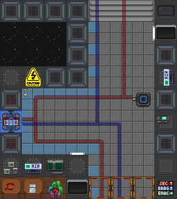
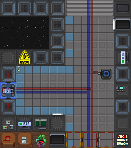
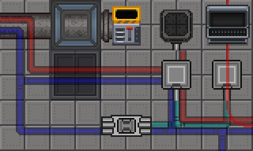

# Mapping Requirements

In order for mapping changes to comply with our existing codebase, conventions,
and in-game systems, there are several guidelines that must be followed.

## Technical Standards

### Atmospherics and Cables

1. Unless absolutely necessary, do not run atmospherics pipes or disposals pipes
   under wall turfs. **NEVER** run cables under wall turfs.

2. Every room should contain at least one air vent and scrubber. Use the
   following "on" subtype of vents and scrubbers as opposed to varediting:
   `/obj/machinery/atmospherics/unary/vent_scrubber/on` and
   `/obj/machinery/atmospherics/unary/vent_pump/on`.

3.  Run air pipes together where possible. The first example below is to be
    avoided, the second is optimal:

     

    Pipe layouts should be logical and predictable, easy to understand at a
    glance. Always avoid complex layouts like in this example:

    

4. External areas, or areas where depressurisation is expected and normal,
   should use airless turf variants to prevent additional atmospherics load.

5. Tiny fans (`/obj/structure/fans/tiny`) can be used to block airflow into
   problematic areas, but are not a substitute for proper door and firelock
   combinations. They are useful under blast doors that lead to space when
   opened.

### Wall Mounts

1. Every station area (`/area/station` subtypes) should contain only one APC and
   air alarm.

2. Critical infrastructure rooms (such as the engine, arrivals, and medbay
   areas) should be given an APC with a larger power cell. Use the
   `/obj/machinery/power/apc/important` and `/obj/machinery/power/apc/critical`
   mapping helpers for this purpose.

3. Every room should contain at least one fire alarm. Fire alarms should not be
   placed next to expected heat sources.

4. Every room should contain at least one station intercom. Intercoms should be
   set to frequency `145.9`, and be speaker ON Microphone OFF. This is so radio
   signals can reach people even without headsets on. Larger rooms will require
   more than one at a time.

5. Every room should have at least one security camera with the caveats listed
   in the [Design Guide](design.md). Larger rooms may require more than one
   security camera. All security cameras should have a descriptive name that
   makes it easy to find on a camera console. A good example would be the
   template \[Department name\] - \[Area\], so Brig - Cell 1, or Medbay -
   Treatment Center. Consistency is key to good camera naming.

6. Every room should have at least one light switch. When possible, light
   switches should be placed in such a position that a player can activate them
   while standing on the same tile as the room's airlock. Players should not
   have to wander through a dark room to find the light switch.

7. Head of Staff offices should contain a requests console, using the
   `/obj/machinery/requests_console/directional` helpers. Console department
   names and types should not be varedited.

8. Use lights sparingly. They draw a significant amount of power.

### Windows, Walls, and Floors

1. Electrochromic windows (`/obj/structure/window/reinforced/polarized`) and
   doors/windoors (using the `/obj/effect/mapping_helpers/airlock/polarized`
   helper) are preferred over shutters as the method of restricting view to a
   room through windows. Shutters are sill appropriate in industrial/hazardous
   areas of the station (engine rooms, HoP line, science test chamber, etc.).
   Electrochromic window/windoor/door sets require a unique ID var, and a
   window tint button (`/obj/machinery/button/windowtint`) with a matching ID
   var. The default `range` of the button is 7 tiles but can be amended with a
   varedit.

2. Windows to secure areas or external areas should be reinforced. Windows in
   engine areas should be reinforced plasma glass. Windows in high security
   areas, such as the brig, bridge, and head of staff offices, should be
   electrified by placing a wire node under the window.

3. Engine areas, or areas with a high probability of receiving explosions,
   should use reinforced flooring if appropriate.

### Airlocks, Windoors, and Firelocks

1. Firelocks should be used at area boundaries over doors and windoors, but not
   windows. Firelocks can also be used to break up hallways at reasonable
   intervals. Double firelocks are not permitted. Maintenance access doors
   should never have firelocks placed over them.

2. Door and windoor access must be correctly set by the
   `/obj/effect/mapping_helpers/airlock/access` and
   `/obj/effect/mapping_helpers/airlock/windoor/access` [helpers][],
   respectively. Pay attention to the `any` and `all` subtypes; the `any`
   subtype allows someone with any of the accesses on the airlock to use it,
   and the `all` subtypes requires the user to have all of the access on the
   airlock to use it.

    For example, on the Cerebron (Metastation), miners must walk through the
    Cargo Bay to access the Mining Dock. They do not have Cargo Bay access,
    rather the Cargo Bay airlocks have two access helpers on them:

    - `/obj/effect/mapping_helpers/airlock/access/any/supply/cargo_bay`
    - `/obj/effect/mapping_helpers/airlock/access/any/supply/mining`

    This allows both cargo technicians and miners to use those airlocks.

    Old doors that use var edited access should be updated to use the correct
    access helper, and the var edit on the door should be cleaned.

### Shuttles

1. When adding new shuttles, or remapping departures areas, contributors must
   ensure that all existing and new shuttles continue to fit and dock to the
   correct airlocks as expected. Any time docking ports are edited, the author
   needs to confirm the `width`, `height`, and `dwidth` variables between the
   two permanent ports and mobile port are compatible.

2. All shuttles that have a brig area, should using the flooring type
   `/turf/simulated/floor/mineral/plastitanium/red/brig`.
   This is required to count antagonists as captured on the escape shuttle.

### Other

1. Edits in mapping tools should almost always be possible to replicate
   in-game. For this reason, avoid stacking multiple structures on the same
   tile (e.g. placing a light and an APC on the same wall).

[helpers]: https://github.com/ParadiseSS13/Paradise/blob/master/code/modules/mapping/access_helpers.dm

### Varedits

*Varediting*, or variable editing, is the term for modifying a variable of an
object on the map, instead of in code. There are many legitimate reasons to do
so. For example, since nearly all floor tiles on the station are the same
object, their `icon_state` and `dir` variables need to be edited to modify their
appearance.

However, there are also cases when varediting is not appropriate. In general,
when modifying the behavior of an object, creating a subtype in code is almost
always the better option. For example, let's say you have an `/obj/helmet` with
a variable, `strength`, which defines how much damage it can take. The default
is 10. You want to create a stronger helmet, so you add one into a map, and
varedit its `strength` to be 20. This may work for now, but what if the strength
of a helmet no longer is based off that variable? Your helmet will no longer
work as expected. If you instead made an `/obj/helmet/strong`, and made the
variable change there, then if the implementation for `/obj/helmet` changes,
your object will benefit from those changes.

Another example of inappropriate varediting is doing it to an object with many
instances on a map, or multiple instances across maps. If you need to change the
variable, you will then have to find every instance of it across all of the
maps, and change them all.

Areas should **never** be varedited on a map. All areas of a single type,
altered instance or not, are considered the same area within the code, and
editing their variables on a map can lead to issues with powernets and event
subsystems which are difficult to debug.

Subtypes only intended to be used on ruins should be contained within an .dm
file with a name corresponding to that map within `code\modules\ruins`. This is
so in the event that the map is removed, that subtype will be removed at the
same time as well to minimize leftover/unused data within the repo.

When not using StrongDMM (which handles the following automatically) please
attempt to clean out any dirty variables that may be contained within items you
alter through varediting. For example changing the `pixel_x` variable from 23 to
0 will leave a dirty record in the map's code of `pixel_x = 0`.

Unless they require custom placement, when placing the following items use the
relevant directional mapper, as it has predefined pixel offsets and directions
that are standardised: APC, Air alarm, Fire alarm, station intercom, newscaster,
extinguisher cabinet, light switches.

## Submap Requirements

1. Currently, while they do not have to be exactly rectangular, submaps cannot
   be larger than 24x24 tiles. This is in order to prevent them from being too
   difficult to review or navigate and get used to in-game.

2. Submaps are **not** to be used as a proxy to change something you do not like
   about a map. If you have issues with the balance or design of a map, those
   issues should be addressed with ordinary remap PRs.

### Stations

1. Submaps on stations may only be used in maintenance tunnels, and only one
   submap per area (i.e. fore, aft) is permitted. This restriction may be
   relaxed in the future, but is in place to prevent player confusion and
   frustration with too many map areas changing.

2. Submaps in maintenance tunnels should continue to comply with existing rules
   about signposting. Areas in maints should remain recognizable regardless of
   submap configuration. This means that pre-existing signposts should be
   respected, such as the abandoned medical area in Box medmaints, the mining
   equipment in Cere cargo maints, etc.

3. To prevent overuse of submaps, there is currently a restriction of three per
   station. This limit may be raised depending on how submaps are received by
   players. The areas chosen are first-come, first serve. Whoever gets their
   changes mapped in first sets the available submaps.
   
4. There is no hard limit on the number of variants per submap, though we ask
   you keep it to a reasonable number.

5. Submaps may not replace tiles which have atmos pipes, power cables, or other
   engineering/atmospherics equipment. This is to prevent this equipment from
   being hidden with walls or no longer accessible via their pre-existing
   primary paths through maintenance. The exception is for equipment that is
   only used in the submap; for example, the cables to a rage cage.

6. One submap variant must be an exact duplicate of the original area's
   contents. A variant will always be chosen, and so it's necessary that an
   "original" variant is available. The original contents of the submap should
   remain as is, in case mapmanip fails to load altogether.

### Ruins

1. Submaps on ruins are allowed to be more flexible. There's currently no limit
   on how many submaps may be used on a given ruin, however the 24x24 tile limit
   remains.

2. Submaps should be used to increase the number of unique ways a ruin can be
   approached and run, including randomizing specific challenges, rewards, and
   paths through the ruin. They should not be used purely for decorative
   purposes, or for changes that could be accomplished using existing random
   spawners.

## Mapper Contribution Guidelines

These guidelines apply to **all** mapping contributors.

For mapping PRs, we do not accept 'change for the sake of change' remaps, unless
you have very good reasoning to do so. Maintainers reserve the right to close
your PR if we disagree with your reasoning. Large remaps, such as those to a
department, must be justified with clear, specific reasons.

Before committing a map change, you **MUST** run Mapmerge to normalise your
changes. You can do this manually before every commit with `tools\mapmerge2\Run
Before Committing.bat` or by letting the [git hooks](./quickstart.md#mapmerge)
do it for you. Failure to run Mapmerge on a map after editing greatly increases
the risk of the map's key dictionary becoming corrupted by future edits after
running map merge. Resolving the corruption issue involves rebuilding the map's
key dictionary.

If you are making non-minor edits to an area or room, (non-minor being anything
more than moving a few objects or fixing small bugs) then you should ensure the
entire area/room is updated to meet these standards.
