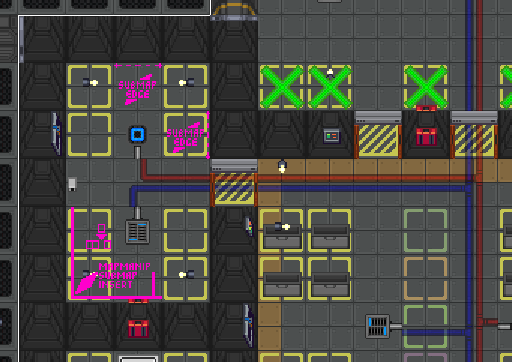
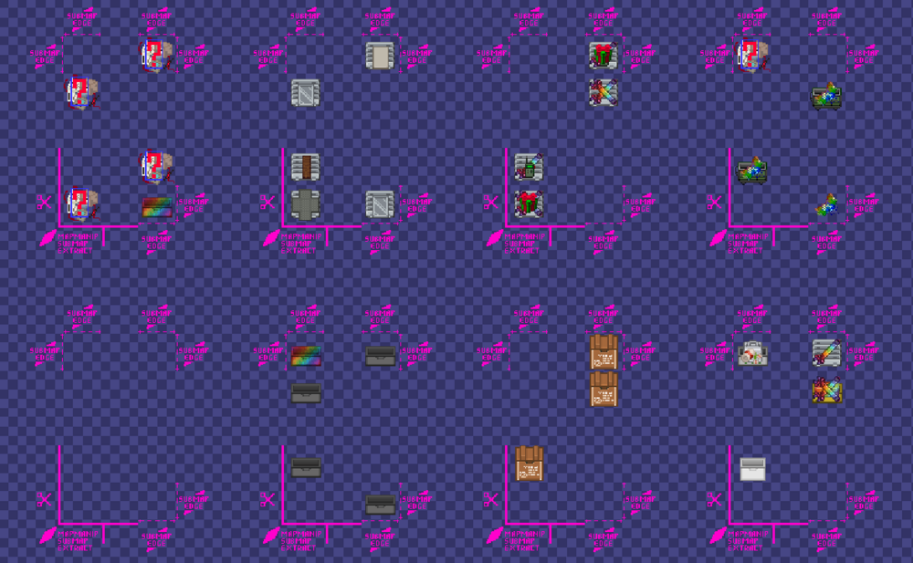
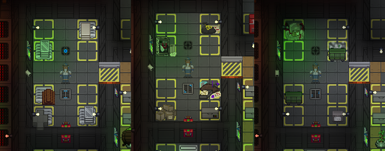
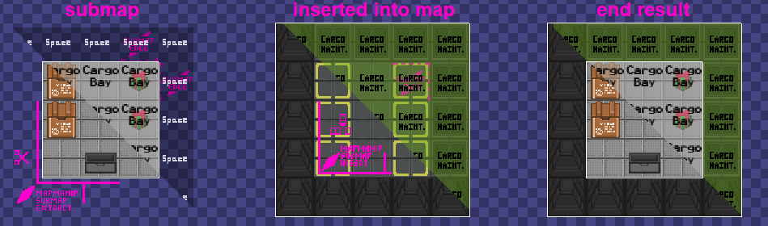
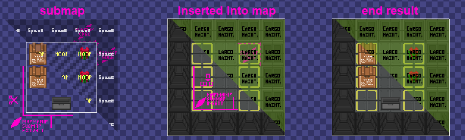
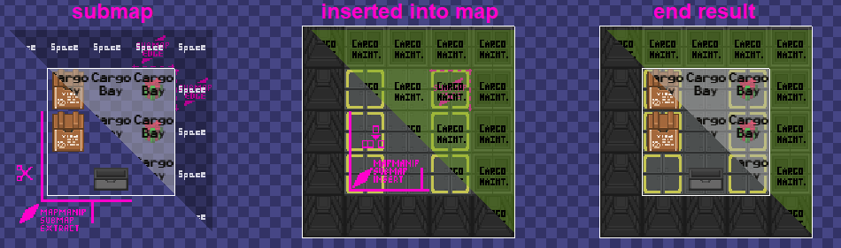
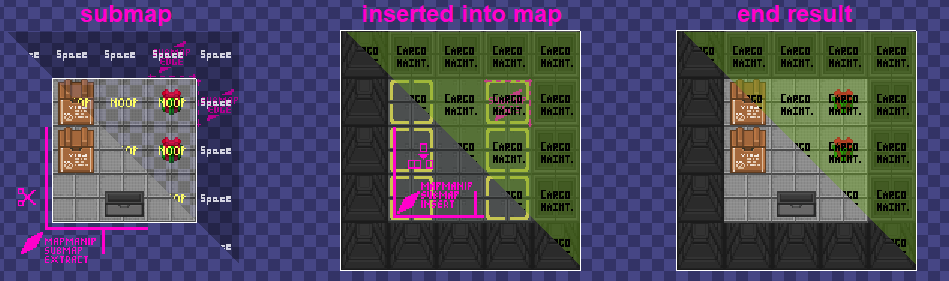
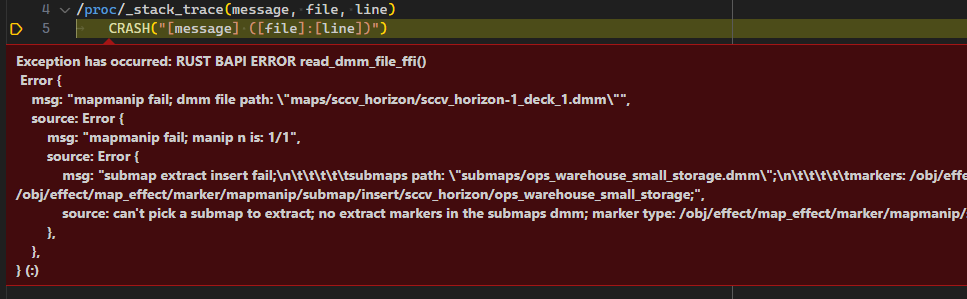
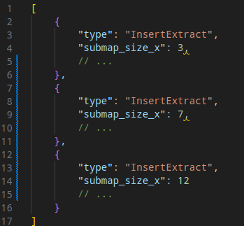

# Guide to Submaps

> [!NOTE]
>
> This guide was originally written by developer Dreamix for Aurora Station, the
> original codebase the `mapmanip` library was written in. Despite the difference
> in appearance of the screenshots, the guide is still applicable.

Submaps are a mechanism to allow copy-pasting parts of maps (submaps) into other
maps, implemented with the `mapmanip` library. `mapmanip` is a library for map
manipulation, and happens before the map is actually loaded by the server. This
is implemented using Rust, instead of DM code. Map manipulations are configured
and defined by adding a `.jsonc` file corresponding to a `.dmm` map. Currently,
the only available map manipulation is submap extraction/insertion.

## But Why

This allows for adding variations to maps, beyond just using `/obj/random/...`
items. Variations of bigger parts of maps, like, for example, whole rooms. Or
even whole layouts, making it so a map looks different every time it is visited.

## How To Do It

1.  Firstly, define two markers for each submap. The types need to be unique, and
    the types are used later to define where to extract the submap from, and where
    to insert it. Here, we want to add some variation to the small warehouse storage
    room.

    ```dm
    /obj/effect/map_effect/marker/mapmanip/submap/extract/station/boxstation/warehouse_small_storage
    	name = "Boxstation, Cargo Warehouse Small Storage"

    /obj/effect/map_effect/marker/mapmanip/submap/insert/station/boxstation/warehouse_small_storage
    	name = "Boxstation, Cargo Warehouse Small Storage"
    ```

2.  Figure out the area that the submap will be inserted into on the map, and add
    the insert marker there. In this case the map is
    `maps/stations/boxstation.dmm`, and the size of that area is 3x5
    tiles, being the little side warehouse. Here, we want the submaps to only be the
    "cargo" or "contents" of the warehouse. So this room is already fully
    functional, with lights, cameras, pipes, etc. Do note that the "submap edge"
    helper markers are just visual helpers, and they have no function.

    

3.  Create a new map file that will contain the submap variants to extract from.
    In this case it is `maps/stations/submaps/warehouse_small_storage.dmm`.
    Add all the possible variants here, each having the same extract marker. They
    must all be the chosen size, in this case being 3x5 tiles. We want the submaps
    to only contain "cargo" or "contents" of the warehouse, so both the turf and
    area are set to "noop". How are "noop" areas and turfs handled, see the next
    part of this guide.

    

4.  Create the mapmanip configuration file, that will actually define the map
    manipulation, and make it happen. In this case it is
    `maps/stations/boxstation.jsonc`. Do notice how the path and
    name of this config file is exactly the same as of the map
    `.../boxstation.dmm`, just with a different extension. Each
    submap manipulation has these vars defined:

    - `type` - Map manipulation type. For submap manipulations it is "SubmapExtractInsert".
    - `submap_size_...` - Size of the submap, width and height.
    - `submaps_dmm` - This is the relative path to the DMM file containing the
      submaps. Relative, meaning to the `.dmm` that is being loaded. In this
      case, it is put in a separate folder for better organization, but it could
      be in the same folder as the `.dmm` file that is being manipulated.
    - `marker_...` - Typepaths to the insert and extract markers, as defined in
      the first step of this guide, and as added into the maps in step two and
      three.
    - `submaps_can_repeat` - Decides whether submaps can repeat when inserting
      them into different places on the map. If there are more extract markers
      than insert markers, it is safe to set it to `true`. Otherwise it should
      be `false`, or else there may not be enough submaps to insert, and map
      manipulation will fail.

    ```json
    [
    	{
    		// Boxstation warehouse, intended for randomized items
    		"type": "SubmapExtractInsert",
    		"submap_size_x": 3,
    		"submap_size_y": 5,
    		"submaps_dmm": "stations/submaps/warehouse_small_storage.dmm",
    		"marker_extract": "/obj/effect/map_effect/marker/mapmanip/submap/extract/station/boxstation/warehouse_small_storage",
    		"marker_insert": "/obj/effect/map_effect/marker/mapmanip/submap/insert/station/boxstation/warehouse_small_storage",
    		"submaps_can_repeat": true // doesn't matter, as there's only one insert marker
    	}
    ]
    ```

5.  Run the server locally and observe the results.

    

    Mapmanip can also generate permutations of your map at the command line, by
    running:

    ```sh
    .\tools\rustlib_tools\mapmanip.ps1
    ```

    This will create a version of every map that has submaps and save them with
    the suffix `mapmanipout.dmm`, wherever the original map is located.

## Areas and Turfs

Areas and turfs, and specifically their "noop" types, have special meaning in
submap manipulation. They determine whether the submap manipulation is more like
"replacing" or "appending". The "noop" (short for "no-operation") types for
turfs is `/turf/template_noop`, and for areas it is `/area/template_noop`.

If neither area nor turf are noop: submap tile atoms replace map tile atoms
entirely, including turf and area. This could be used for submaps that are fully
functional rooms, like a medbay submap and a brig submap, with their own areas
defined in their submaps.



If both area and turf are noop: All atoms on a submap tile are inserted/appended
into the map tile, with the exception for area and turf. This can be used for
places like a warehouse, where only the actual cargo is in submaps, and on the
map the warehouse is fully functional and implemented (just empty).



If only turf is noop, while area is non-noop: All atoms are inserted/appended
into the map tile, but the resulting area used is of the submap tile.
Admittedly, I cannot think of a good use case for this specific feature, but I
am including it here for completeness.



If only area is noop, while turf is non-noop: Submap tile atoms replace map tile
atoms entirely, with the exception of area - resulting area is of the map, not
the submap. This could be used to have different warehouses that use the same
submaps, in different parts of a station or outpost, and so using different
areas.



## Errors and Debugging

If a map manipulation fails, it should do both these things:

- Return `null`, and in that case the map is loaded without any map
  manipulations, as a fallback.
- Generate a stack trace, that can be caught. To do so, must run with debugging,
  and have breakpoints on runtime errors. It should show a stack trace like
  below, with information about what happened.

  

## Other Notes

- The `.jsonc` config file is using the JSONC format, which is a bit strict to
  how it should look, and especially cares about commas. JSONC is "JSON with
  comments". Exactly the same as JSON, with the only difference being that it
  allows `// comments`.

- There may be multiple different submap insert/extract manipulations defined
  for one map. Every submap manipulation is going to require its own set of
  markers. In that case the `.jsonc` would look roughly like this.

  

- If a map has multiple submap operations defined, they can be all in the same
  submap dmm file, or can be in different ones. They can also be in the same
  folder as the main map, or in some subfolder. Use whatever is best for
  organization.

- Submaps can be "recursive", where a submap may contain a insert marker for
  another submap. The contained submaps won't be automatically inserted,
  however, and they still require their own manipulations in the config.

## Possible Uses

- Warehouse with different cargo every round. One round it could be empty,
  another it could have a few crates with guns and armor, another time it could
  be full of building materials.
- Armory with a few different possible loadouts. One with lots of weak SMGs and
  strong armor, another variant with just a few strong rifles and weak armor.
- Big crew quarters with 20 rooms, but randomly filled with submaps with only 5 variants.
- Hallway on a planetary outpost with one variant where it is fine and "normal",
  and another variant where it is blocked by some rocks, forcing people to find
  another way through.
- Alternative possible layouts for the whole map, where rooms and departments
  are in different places every round.
- The sky is the limit, literally.

## Submaps Design Guidelines

1. Currently, while they do not have to be exactly rectangular, submaps cannot
   be larger than 24x24 tiles. This is in order to prevent them from being too
   difficult to review or navigate and get used to in-game.

2. Submaps are **not** to be used as a proxy to change something you do not like
   about a map. If you have issues with the balance or design of a map, those
   issues should be addressed with ordinary remap PRs.

### Stations

1. For the time being, submaps on stations may only be used in maintenance
   tunnels, and only one submap per area (i.e. fore, aft) is permitted.

2. Submaps in maintenance tunnels should continue to comply with existing rules
   about signposting. Areas in maints should remain recognizable regardless of
   submap configuration. This means that pre-existing signposts should be
   respected, such as the abandoned medical area in Box medmaints, the mining
   equipment in Cere cargo maints, etc.

3. To prevent overuse of submaps, there is currently a restriction of three per
   station. This limit may be raised depending on how submaps are received by
   players. The areas chosen are first-come, first serve. Whoever gets their
   changes mapped in first sets the available submaps.

4. Submaps should be used to increase variety and add an element of chance to
   player mechanics. They should not be used with an intention to confuse
   players, or to cut off the primary path through the maintenance tunnels.
   Primary paths through maints can make detours but must return to their
   original ingress and egress points. Paths which lead to department maints
   airlocks must remain obvious and easily accessible.

5. Submaps may not replace tiles which have atmos pipes, power cables, or other
   engineering/atmospherics equipment. This is to prevent this equipment from
   being hidden with walls or no longer accessible via their pre-existing
   primary paths through maintenance.

6. All [pre-existing balance guidelines][guidelines] regarding mapping apply to
   submaps. Loot counts must remain consistent. Walls should only be reinforced in
   appropriate places. There should be no "treasure troves" or hoards only
   accessible with detailed map knowledge. AI cameras cannot be placed in maints
   submaps. Antag/sec balance, tactical flexibility, and navigability must be
   considered. Dead ends are to be avoided. Department maintenance airlocks may
   not be moved or removed.

   [guidelines]: https://devdocs.paradisestation.org/mapping/design/#balance-guidelines

7. One submap must be an exact duplicate of the original area's contents. A
   submap will never not be chosen, and so it's necessary there be a submap of
   the original area's contents so that a variant with those contents spawns.

8. The original contents of the submap's area should remain as is. This is so
   that in the event mapmanip fails, the original area's contents can still be
   used.

9. Currently, submaps which replace entire areas of maints are discouraged until
   we see a design that will not frustrate players or become a balance problem
   regarding sec/antag navigability. If someone is willing to create a PR to
   prototype this, they are welcome to, but there is no guarantee it will be
   accepted. A PR of this kind is not subject to the 24x24 size constraint rule.

### Ruins

1. Submaps on ruins are allowed to be more flexible. There's currently no limit
   on how many submaps may be used on a given ruin, however the 24x24 tile limit
   remains.

2. Submaps should be used to increase the number of unique ways a ruin can be
   approached and run, including randomizing specific challenges, rewards, and
   paths through the ruin. They should not be used purely for decorative
   purposes, or for changes that could be accomplished using existing random
   spawners.
