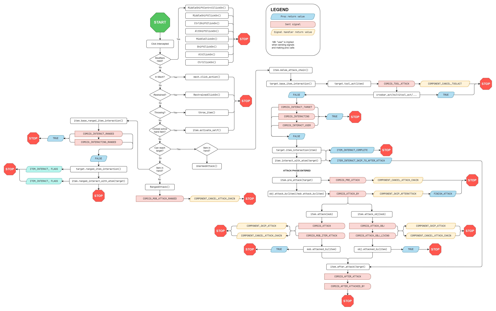

# The Attack Chain

The vast majority of things that happen when a player performs an action on an
object or another player occurs within the _attack chain_. The attack chain is
the set of procs and signals that determine what should happen when an action is
performed, if an attack should occur, and what to do afterwards.

## Overview

The attack chain is made up of multiple procs and signals which are expected to
respect each other's responses as to how the attack chain should be executed.
For most mobs, this begins in [`/mob/proc/ClickOn`][clickon].

First, any click performed with a modifier key such as `SHIFT` or `ALT` is
handled first in separate procs. A handful of global use cases are handled next,
such as if the user is in a mech, if they are restrained, if they are throwing
an item, or if the thing they're interacting with is an SSD player.

The core of the attack chain commences:

1. If the user is holding the item and clicking on it,
   `/obj/item/activate_self()` is called. This sends `COMSIG_ACTIVATE_SELF` and
   cancels the rest of the attack chain if `COMPONENT_CANCEL_ATTACK_CHAIN` is
   returned by any listeners.
2. If the user can reach the item or it is in relatively accessible inventory
   (three levels deep), the melee attack chain is called via
   `/obj/item/melee_attack_chain()`.
3. If the user is on HELP intent and the item is a tool, the various
   `multitool_act()`/`welder_act()`/`screwdriver_act()`/etc. methods are called
   depending on the tool type. This typically causes the attack chain to end.
4. Several signals are sent: `COMSIG_INTERACT_TARGET`, `COMSIG_INTERACTING`, and
   `COMSIG_INTERACT_USER`. If any listeners request it (usually by returning a
   non-null value), the attack chain may end here.
5. If the target implements `item_interaction()`, it is called here, and can
   either return `ITEM_INTERACT_COMPLETE` to end the attack chain, or
   `ITEM_INTERACT_SKIP_TO_AFTER_ATTACK` to skip all phases of the attack chain
   except for after-attack.
6. If the item being used on the target implements `interact_with_atom()`, it is
   called here, and can either return `ITEM_INTERACT_COMPLETE` to end the attack
   chain, or `ITEM_INTERACT_SKIP_TO_AFTER_ATTACK` to skip all phases of the
   attack chain except for after-attack.

The above steps can generally be considered the "item interaction phase", when
the action is not meant to cause in-game harm to the target. If the attack chain
has not been ended, this means we are in the "attack phase":

1. `pre_attack()` is called on the used item, which sends `COMSIG_PRE_ATTACK`,
   and cancels the rest of the attack chain if any listeners return
   `COMPONENT_CANCEL_ATTACK_CHAIN`.
2. `attack_by()` is called on the target. This sends `COMSIG_ATTACKBY`, and
   cancels the rest of the attack chain if any listeners return
   `COMPONENT_SKIP_AFTERATTACK`.
3. `attacked_by()` is called on the target.
4. `COMSIG_AFTER_ATTACK` is sent on the used item, and
   `COMSIG_AFTER_ATTACKED_BY` is sent on the target.

The benefits of this approach is that it allows an enormous amount of
flexibility when it comes to dealing with attacks, while ensuring that behaviors
that are always expected occur consistently.

For a high-level flowchart of the attack chain, see below. Note that this
flowchart may not be 100% accurate/up-to-date. When in doubt, check the
implementation.

<!-- To modify this flowchart, see the file `attack_chain_flowchart.drawio` -->
<!-- The flowchart may be modified with draw.io for Desktop:                -->
<!-- https://github.com/jgraph/drawio-desktop/releases/                     -->



[clickon]: https://codedocs.paradisestation.org/mob.html#proc/ClickOn

## Why?

A reasonable question to ask would be, why do we need all of these procs and
signals?

A good way to think of the attack chain is as a series of suggestions, rather
than a series of instructions. If a player attacks a mob with an object, there
are many things in the game world that may want to have a say in whether that
will happen, and how it will happen.

For example, there may be a component attached to the player that wants to
intercept whenever an attack is attempted in order to cancel it or substitute
its own action. The item being used to attack may want to cancel the attack
based on its own internal state. The mob or object being attacked may have
specific ways to react to the attack.

By having as many procs and signals as we do, we're allowing all involved
objects and any attached components or elements to contribute their own behavior
into the attack chain.

### ITEM_INTERACT flags

One may also ask why the `ITEM_INTERACT_SKIP_TO_AFTER_ATTACK` flag is necessary.
Pre-migration, a common pattern was for an object to skip certain items in its
`attackby`, and let those items handle the interaction in their `afterattack`.
Some examples of this include:

- Mountable frames being "ignored" in `/turf/attackby`, in order to let
  `/obj/item/mounted/frame/afterattack` handle its specific behavior.
- Reagent containers being "ignored" in various machines' `attackby`, in order
  to let the container's `afterattack` handle reagent transfer or other specific
  behavior.

## Attack Chain Refactor

The attack chain was overhauled in [#26834][]. This overhaul introduced several
safeties, renamed many procs and signals, and helped to ensure consistent
handling of signals in order to help make the attack chain more reliable.

[#26834]: https://github.com/ParadiseSS13/Paradise/pull/26834

Prior to the attack chain refactoring, this system was disorganized and its
behavior was not unified. Some procs would call their parent procs, some
wouldn't. Some would send out signals at the right time, some wouldn't. The
attack chain refactor unified all this behavior, but it did not do it across the
entire codebase, all at once.

Instead, a separate codepath was introduced, and all existing uses of the attack
chain were placed in separate procs. These are easily identified by procs which
contain `legacy__attackchain` in the name. The goal is to move all uses of the
legacy attack chain onto the new one, but it would be infeasible to attempt to
do this all at once.

Anyone can choose to migrate attack chains if they so desire to help complete
the migration.

> [!NOTE]
>
> If you are working in code that touches the legacy attack chain, it is
> expected that you migrate the code to the new attack chain first.

## Performing Migrations

Procs with the `__legacy__attackchain` suffix must be carefully understood in
order to migrate them properly. This is not just a matter of renaming procs; it
is expected that a migration preserve all existing behavior while fixing any
potential bugs that were a result of the original implementation.

There are several important points:

1. Any subtype which is being migrated must have all of its parent types (up to
   but not including `/obj/item`) migrated as well. If you are migrating
   `/obj/item/foo/bar/baz/proc/attacked_by__legacy__attackchain()`, then you
   must also migrate `/obj/item/foo/bar/proc/attacked_by__legacy__attackchain()`
   and `/obj/item/foo/proc/attacked_by__legacy__attackchain()`.
2. Once a tree of items has been updated to the new attack chain, its
   `new_attack_chain` var must be set to `TRUE`.
3. All legacy attack chain procs in an object tree must be migrated at once.

While this may seem overwhelming, the good news is that most migrations are
straightforward, and because you are only migrating a small part of the codebase
at a time, it is easy to test the results.

In order to make this process easier, we'll examine some sample migrations that
have already been performed.

### `attackby`

`attackby` is used in cases when an item needs to respond to another item being
used on it. These can be fairly straightforward if the type tree is shallow and
the number of interactions is small.

Something to note is that `attackby`, despite its name, rarely has behavior that
is designed to respond to combat attacks. Most `attackby` methods you will find
are simple item interactions; specific behavior the objects want to intercept
before allowing the attack phase to begin.

Our example migration is `/obj/vehicle`. This type tree only requires migrating:

- `/obj/vehicle/proc/attackby__legacy__attackchain`
- `/obj/vehicle/janicart/proc/attackby__legacy__attackchain`

First, let's look at `/obj/vehicle/attackby__legacy__attackchain`:

```dm
/obj/vehicle/attackby__legacy__attackchain(obj/item/I, mob/user, params)
	if(key_type && !is_key(inserted_key) && is_key(I))
		if(user.drop_item())
			I.forceMove(src)
			to_chat(user, "<span class='notice'>You insert [I] into [src].</span>")
			if(inserted_key)	//just in case there's an invalid key
				inserted_key.forceMove(drop_location())
			inserted_key = I
		else
			to_chat(user, "<span class='warning'>[I] seems to be stuck to your hand!</span>")
		return
	if(istype(I, /obj/item/borg/upgrade/vtec) && vehicle_move_delay > 1)
		vehicle_move_delay = 1
		qdel(I)
		to_chat(user, "<span class='notice'>You upgrade [src] with [I].</span>")
		return
	return ..()
```

The logic here is pretty straightforward. We check to see if the user is
attempting to insert a key, if there's already one in the vehicle, and if the
key can be dropped by the user. We also check to see if the user is attempting
to install the VTEC upgrade. Otherwise we return control to the parent.

Now let's look at `/obj/vehicle/janicart/attackby__legacy__attackchain`:

```dm
/obj/vehicle/janicart/attackby(obj/item/I, mob/user, params)
	var/fail_msg = "<span class='notice'>There is already one of those in [src].</span>"

	if(istype(I, /obj/item/storage/bag/trash))
		if(mybag)
			to_chat(user, fail_msg)
			return
		if(!user.drop_item())
			return
		to_chat(user, "<span class='notice'>You hook [I] onto [src].</span>")
		I.forceMove(src)
		mybag = I
		update_icon(UPDATE_OVERLAYS)
		return
	if(istype(I, /obj/item/borg/upgrade/floorbuffer))
		if(buffer_installed)
			to_chat(user, fail_msg)
			return
		buffer_installed = TRUE
		qdel(I)
		to_chat(user,"<span class='notice'>You upgrade [src] with [I].</span>")
		update_icon(UPDATE_OVERLAYS)
		return
	if(istype(I, /obj/item/borg/upgrade/vtec) && floorbuffer)
		floorbuffer = FALSE
		vehicle_move_delay -= buffer_delay
		return ..() //VTEC installation is handled in parent attackby, so we're returning to it early
	if(mybag && user.a_intent == INTENT_HELP && !is_key(I))
		mybag.attackby(I, user)
	else
		return ..()
```

Here the logic is a bit more complex, but has a basic structure: we check to see
what kind of thing the janicart is being attacked with. If it's a trash bag or
floor buffer, we attach it. If it's VTEC upgrade we remove the floorbuffer and
return control to the parent for installing the VTEC. If there's a bag and the
user is clicking on it with anything else with help intent, attempt to put it in
the bag. Otherwise, return control to the parent.

Most of this logic will work just fine as is. However, none of this is
combat-related, so we should pull it out of `attack_by` and substitute in
`item_interaction`. This ensures that all the code involving specific behavior
when clicking on the janicart will run before the attack phase, and not get
in its way.

Note that while `item_interaction` does not require a parent call, in this case
it is useful to us because we want to handle the janicart-specific interactions
before handling the vehicle-specific interactions.

We change all the return statements to return one of the `ITEM_INTERACT_` flags
at each junction whenever we have handled the item interaction.

```diff
-/obj/vehicle/janicart/attackby(obj/item/I, mob/user, params)
+/obj/vehicle/janicart/item_interaction(mob/living/user, obj/item/I, list/modifiers)
 	var/fail_msg = "<span class='notice'>There is already one of those in [src].</span>"

 	if(istype(I, /obj/item/storage/bag/trash))
 		if(mybag)
 			to_chat(user, fail_msg)
-			return
+			return ITEM_INTERACT_COMPLETE
 		if(!user.drop_item())
-			return
+			return ITEM_INTERACT_COMPLETE
 		to_chat(user, "<span class='notice'>You hook [I] onto [src].</span>")
 		I.forceMove(src)
 		mybag = I
 		update_icon(UPDATE_OVERLAYS)
-		return
+		return ITEM_INTERACT_COMPLETE
+
 	if(istype(I, /obj/item/borg/upgrade/floorbuffer))
 		if(buffer_installed)
 			to_chat(user, fail_msg)
-			return
+			return ITEM_INTERACT_COMPLETE
 		buffer_installed = TRUE
 		qdel(I)
 		to_chat(user,"<span class='notice'>You upgrade [src] with [I].</span>")
 		update_icon(UPDATE_OVERLAYS)
-		return
-	if(istype(I, /obj/item/borg/upgrade/vtec) && floorbuffer)
+		return ITEM_INTERACT_COMPLETE
+
+	if(mybag && user.a_intent == INTENT_HELP && !is_key(I))
+		mybag.attackby__legacy__attackchain(I, user)
+		return ITEM_INTERACT_COMPLETE
+
+	return ..()
```

We also refactor the code regarding VTEC installation: because one subtype does
something different in reaction to the installation, we will pull that into its
own proc, so that the parent interaction can handle that behavior.

```diff
+/obj/vehicle/janicart/install_vtec(obj/item/borg/upgrade/vtec/vtec, mob/user)
+	if(..() && floorbuffer)
 		floorbuffer = FALSE
 		vehicle_move_delay -= buffer_delay
-		return ..() //VTEC installation is handled in parent attackby, so we're returning to it early
-	if(mybag && user.a_intent == INTENT_HELP && !is_key(I))
-		mybag.attackby(I, user)
-	else
-		return ..()
+
+	return TRUE
```

This allows us to keep the VTEC-specific behavior separate.

```diff
+/obj/vehicle/janicart/install_vtec(obj/item/borg/upgrade/vtec/vtec, mob/user)
+	if(..() && floorbuffer)
+		floorbuffer = FALSE
+		vehicle_move_delay -= buffer_delay
+
+	return TRUE
```

That is: if the VTEC installation was successful, we disable the floorbuffer and
its delay. We want to return `TRUE` at the end no matter what, because this is
the indication not that the VTEC installation was succesful, but that it was
attempted, and thus the rest of the attack chain is not necessary.

We'll take the opportunity to rename the passed in argument from `I` to `used`
to make the code clearer, as well:

```diff
-/obj/vehicle/janicart/item_interaction(mob/living/user, obj/item/I, list/modifiers)
+/obj/vehicle/janicart/item_interaction(mob/living/user, obj/item/used, list/modifiers)

// etc...
```

Finally, set `new_attack_chain = TRUE` on `/obj/vehicle.`

> [!NOTE]
>
> An advantage of migrating the attack chain procs piecemeal is that each PR
> requires less testing relative to the whole, but this testing must still
> occur.
>
> It is important to come up with a comprehensive list of things to test for
> each migration PR. For the above migration, an example set of tasks might
> include:
>
> - Testing that bags can be attached to janicarts
> - Testing that players can get on and off all vehicles
> - Testing that keys can be inserted into vehicles
> - Testing that only the correct keys can be inserted into vehicles
> - Testing attacking vehicles with other objects
> - Testing adding the floor buffer to janicarts
> - Testing adding VTEC to vehicles
> - Come up with your own test cases!
>
> The valuable thing about keys and attacks with other objects is because
> they're not part of the new attack chain yet. This helps to ensure the legacy
> and new attack chains are interacting with each other properly, as well.

### `attack_self`

`attack_self` is, typically, not part of the chain's attack phase at all. In the
new attack chain, the proc is called `activate_self` to reflect this.

Let's examine the case of airlock electronics, `/obj/item/airlock_electronics`.
This is a good example because it has no parent types we need to migrate. Here
is the proc before the migration:

```dm
/obj/item/airlock_electronics/attack_self__legacy__attackchain(mob/user)
	if(!ishuman(user) && !isrobot(user))
		return ..()

	if(ishuman(user))
		var/mob/living/carbon/human/H = user
		if(H.getBrainLoss() >= max_brain_damage)
			to_chat(user, "<span class='warning'>You forget how to use [src].</span>")
			return
	ui_interact(user)
```

There's a couple things to note here:

1. Currently, the parent proc is only called if the player is in a mob that
   isn't meant to interact with the electronics; which means the signal
   `COMSIG_ACTIVATE_SELF` is only sent if the electronics _aren't_ activated by
   the user!
2. The behavior regarding brain damage and being unable to use the electronics
   seems like it would be much more useful if generalized into a component, but
   we can ignore that for now.

The first thing we do is ensure that the parent proc is called at the correct
time, and correctly respond to its requests if the interaction should be cancelled:

```diff
/obj/item/airlock_electronics/attack_self__legacy__attackchain(mob/user)
+	if(..())
+		return

	if(!ishuman(user) && !isrobot(user))
		return ..()
```

Secondly, we can pull the other guard clause into the conditional, since it
returns in the same manner:

```diff
/obj/item/airlock_electronics/attack_self__legacy__attackchain(mob/user)
-	if(..())
+	if(..() || (!ishuman(user) && !isrobot(user)))
		return

-	if(!ishuman(user) && !isrobot(user))
-		return ..()
```

Then, we rename the proc:

```diff
-/obj/item/airlock_electronics/attack_self__legacy__attackchain(mob/user)
+/obj/item/airlock_electronics/activate_self(mob/user)
```

And, importantly, we change the value of `var/new_attack_chain` in the
object declaration to let the attack chain know to use the new proc:

```diff
/obj/item/airlock_electronics
	name = "airlock electronics"
	icon = 'icons/obj/doors/door_assembly.dmi'
	// ...

+	new_attack_chain = TRUE
```

The migration is complete. The proc now looks like this:

```dm
/obj/item/airlock_electronics/activate_self(mob/user)
	if(..() || (!ishuman(user) && !isrobot(user)))
		return

	if(ishuman(user))
		var/mob/living/carbon/human/H = user
		if(H.getBrainLoss() >= max_brain_damage)
			to_chat(user, "<span class='warning'>You forget how to use [src].</span>")
			return
	ui_interact(user)
```

### `attack`

Let's now look at a more complex example, the cult dagger,
`/obj/item/melee/cultblade/dagger`. This is the code as it exists before the
migration:

```dm
/obj/item/melee/cultblade/dagger/attack__legacy__attackchain(mob/living/M, mob/living/user)
	if(IS_CULTIST(M))
		if(M.reagents && M.reagents.has_reagent("holywater")) //allows cultists to be rescued from the clutches of ordained religion
			if(M == user) // Targeting yourself
				to_chat(user, "<span class='warning'>You can't remove holy water from yourself!</span>")
			else // Targeting someone else
				to_chat(user, "<span class='cult'>You remove the taint from [M].</span>")
				to_chat(M, "<span class='cult'>[user] removes the taint from your body.</span>")
				M.reagents.del_reagent("holywater")
				add_attack_logs(user, M, "Hit with [src], removing the holy water from them")
		return FALSE
	else
		var/datum/status_effect/cult_stun_mark/S = M.has_status_effect(STATUS_EFFECT_CULT_STUN)
		if(S)
			S.trigger()
	. = ..()
```

Because the dagger has a parent proc, let's also examine that:

```dm
/obj/item/melee/cultblade/attack__legacy__attackchain(mob/living/target, mob/living/carbon/human/user)
	if(!IS_CULTIST(user))
		user.Weaken(10 SECONDS)
		user.unEquip(src, 1)
		user.visible_message("<span class='warning'>A powerful force shoves [user] away from [target]!</span>",
							"<span class='cultlarge'>\"You shouldn't play with sharp things. You'll poke someone's eye out.\"</span>")
		if(ishuman(user))
			var/mob/living/carbon/human/H = user
			H.apply_damage(rand(force/2, force), BRUTE, pick("l_arm", "r_arm"))
		else
			user.adjustBruteLoss(rand(force/2, force))
		return
	if(!IS_CULTIST(target))
		var/datum/status_effect/cult_stun_mark/S = target.has_status_effect(STATUS_EFFECT_CULT_STUN)
		if(S)
			S.trigger()
	..()
```

There are several codepaths happening here:

1. If a non-cultist attacks with the dagger, they are forced to drop it, gain
   several status effects, and receive brute damage.
2. If a cultist attacks another cultist, it removes holy water from the target.
   If the target has no holy water in them, it does nothing.
3. If a cultist attacks a non-cultist, and the non-cultist has a cult-stun
   status effect, it is prolonged.

Several issues should become apparent while reading through this. First let's
determine when the root `attack()` proc is actually called:

1. In `cultblade/dagger/attack()`, there is an early return if the target is a cultist.
2. In `cultblade/attack()`, there is an early return if the user is _not_ a cultist.

This means that we only wish to follow through with an attack if the user is a
cultist and the target is not. This suggests to us that the code for the first
two codepaths above should come before the `attack()`, logically, the
`pre_attack()`.

(You may also notice a bug in the code. We'll point it out below but see if you
can spot it yourself.)

The first thing we'll do is handle the first codepath, in the dagger's parent
type:

```diff
-/obj/item/melee/cultblade/attack__legacy__attackchain(mob/living/target, mob/living/carbon/human/user)
+/obj/item/melee/cultblade/pre_attack(atom/target, mob/living/user, params)
+	if(..())
+		return FINISH_ATTACK

	if(!IS_CULTIST(user))
		// ...

+		return FINISH_ATTACK
```

We return early if our parent proc asks us to, and we return early if the user
isn't a cultist, because the user can't perform an attack.

We adjust the attack proc itself to check its parent, and perform the cult-stun
trigger. We return nothing to let the attack chain know to continue:

```diff
+/obj/item/melee/cultblade/attack(mob/living/target, mob/living/carbon/human/user)
+       if(..())
+               return FINISH_ATTACK
+
        if(!IS_CULTIST(target))
                var/datum/status_effect/cult_stun_mark/S = target.has_status_effect(STATUS_EFFECT_CULT_STUN)
                if(S)
                        S.trigger()
-       ..()
```

Then we'll handle the dagger itself. Again, we want to cancel the attack chain
if a cultist user is attacking a cultist target, one way or another:

```diff
-/obj/item/melee/cultblade/dagger/attack(mob/living/M, mob/living/user)
-	if(IS_CULTIST(M))
-		if(M.reagents && M.reagents.has_reagent("holywater"))
-			if(M == user) // Targeting yourself
+/obj/item/melee/cultblade/dagger/pre_attack(atom/target, mob/living/user, params)
+	if(..())
+		return FINISH_ATTACK
+
+	if(IS_CULTIST(target))
+		if(target.reagents && target.reagents.has_reagent("holywater"))
+			if(target == user) // Targeting yourself

		// ...

+		return FINISH_ATTACK
```

By regularly calling the parent proc first, it's easier to think through the
process of what's happening. It's much easier to tell that the parent proc
handles failed attacks by non-cultists first, and only if that's not the case
does the holy-water removal behavior run. Since we know we're not a non-cultist
at this point, we don't need to perform a second check for that, either.

This also fixes a bug in the original code. Because the code to re-trigger
cult-stuns on targets was duplicated in both attack procs, it was being called
twice. It's now much easier to tell when that is happening.

The resultant code looks like this:

```dm
/obj/item/melee/cultblade/pre_attack(atom/target, mob/living/user, params)
	if(..())
		return FINISH_ATTACK

	if(!IS_CULTIST(user))
		user.Weaken(10 SECONDS)
		user.unEquip(src, 1)
		user.visible_message("<span class='warning'>A powerful force shoves [user] away from [target]!</span>",
							"<span class='cultlarge'>\"You shouldn't play with sharp things. You'll poke someone's eye out.\"</span>")
		if(ishuman(user))
			var/mob/living/carbon/human/H = user
			H.apply_damage(rand(force/2, force), BRUTE, pick("l_arm", "r_arm"))
		else
			user.adjustBruteLoss(rand(force/2, force))

		return FINISH_ATTACK

/obj/item/melee/cultblade/attack(mob/living/target, mob/living/carbon/human/user)
	if(..())
		return FINISH_ATTACK

	if(!IS_CULTIST(target))
		var/datum/status_effect/cult_stun_mark/S = target.has_status_effect(STATUS_EFFECT_CULT_STUN)
		if(S)
			S.trigger()

/obj/item/melee/cultblade/dagger/pre_attack(atom/target, mob/living/user, params)
	if(..())
		return FINISH_ATTACK

	if(IS_CULTIST(target))
		if(target.reagents && target.reagents.has_reagent("holywater")) //allows cultists to be rescued from the clutches of ordained religion
			if(target == user) // Targeting yourself
				to_chat(user, "<span class='warning'>You can't remove holy water from yourself!</span>")

			else // Targeting someone else
				to_chat(user, "<span class='cult'>You remove the taint from [target].</span>")
				to_chat(target, "<span class='cult'>[user] removes the taint from your body.</span>")
				target.reagents.del_reagent("holywater")
				add_attack_logs(user, target, "Hit with [src], removing the holy water from them")

		return FINISH_ATTACK
```

Not only is it much easier to read and understand what is happening, it is also
divided up into smaller, more manageable procs with clear names to explain the
sequence of events. Finally, because we constantly check the parent proc, all
signals that are expected to be sent, are, so any other components or listeners
can take appropriate action and cancel the attack chain themselves, if requested.

### Cancelling All Behavior

Frequently, a subtype will want to completely prevent any of its parent type
behavior from running. Examples may be a holofloor, which should prevent any
attempts to deconstruct it, or a destroyed variant of an object, which cancels
out the existing functionality of the parent type.

Attack chain methods must always call their parent procs, so this presents a
problem.

In order to implement behavior such as this, the child type should register to
listen for the signal that applies to the attack chain proc, and respond by
calling one of the procs which return a signal preventing the rest of the attack
chain from running.

For `attack_by` prevention, this proc is [/datum/proc/signal_cancel_attack_by][]. For
`activate_self` prevention, this proc is [/datum/proc/signal_cancel_activate_self][].

[/datum/proc/signal_cancel_attack_by]: https://codedocs.paradisestation.org/datum.html#proc/signal_cancel_attack_by
[/datum/proc/signal_cancel_activate_self]: https://codedocs.paradisestation.org/datum.html#proc/signal_cancel_activate_self

For example, when we migrated the airlock electronics above, we neglected to
handle the `/destroyed` subtype, which prevents any interaction via
`activate_self`. To ensure this, we make the following change:

```diff
+/obj/item/airlock_electronics/destroyed/Initialize(mapload)
+	. = ..()
+	RegisterSignal(src, COMSIG_ACTIVATE_SELF, TYPE_PROC_REF(/datum, signal_cancel_activate_self))
```

## Migration Helpers

There are two important tools which can help make the migration process easier:
the _migration plan checker_ and the _attack chain CI checks_.

### Migration Plan Checker

If you are making a code change and need to update the attack chain on an
object, the migration plan checker will tell you what other types will need to
be migrated in the same PR. For example, if I wanted to migrate
`/turf/simulated/wall/cult`, I could run the migration plan checker at the
command line:

> [!NOTE]
>
> When running the migration plan checker, be sure to run it from the root
> directory of your repository (`\Paradise`) and to use the version of Python
> provided by the bootstrap module (`tools\bootstrap\python`). If you know
> specifically that you are running in PowerShell, use the appropriate command
> (`tools\bootstrap\python_.ps1`).

```
$ tools\bootstrap\python .\tools\migrate_attack_chain.py /turf/simulated/wall/cult
Migration Plan for Path /turf/simulated/wall/cult
Required Additional Migrations:
        /turf
        /turf/simulated/floor
        /turf/simulated/floor/chasm
        /turf/simulated/floor/grass
        /turf/simulated/floor/holofloor
        /turf/simulated/floor/indestructible
        /turf/simulated/floor/lava
        /turf/simulated/floor/lava/lava_land_surface/plasma
        /turf/simulated/floor/light
        /turf/simulated/floor/mineral/bananium
        /turf/simulated/floor/mineral/plasma
        /turf/simulated/floor/mineral/uranium
        /turf/simulated/floor/plating
        /turf/simulated/floor/plating/asteroid
        /turf/simulated/floor/plating/metalfoam
        /turf/simulated/floor/vines
        /turf/simulated/mineral
        /turf/simulated/mineral/ancient
        /turf/simulated/mineral/ancient/lava_land_surface_hard
        /turf/simulated/mineral/ancient/outer
        /turf/simulated/wall
        /turf/simulated/wall/indestructible
        /turf/simulated/wall/mineral/plasma
        /turf/simulated/wall/mineral/uranium
        /turf/simulated/wall/mineral/wood
        /turf/simulated/wall/r_wall
        /turf/space
        /turf/space/transit
Toggle `new_attack_chain = TRUE` on:
        /turf
```

You can see the output shows two things:

1. The list of other types that will need to be migrated at the same time, and
2. The type that `new_attack_chain` should be set to TRUE after the migration is
   complete.

This means that instead of just migrating `/turf/simulated/wall/cult`, we will
be migrating 28 types. This is a lot! A migration of this size is not recommended
for new contributors. On the other hand, let us examine migrating wirecutters:

```
$ tools\bootstrap\python .\tools\migrate_attack_chain.py /obj/item/wirecutters
Migration Plan for Path /obj/item/wirecutters
Required Additional Migrations:
        /obj/item/wirecutters
        /obj/item/wirecutters/power
Toggle `new_attack_chain = TRUE` on:
        /obj/item/wirecutters
```

If we wanted to migrate `/obj/item/wirecutters`, we only need to migrate that
type and one other, the power wirecutters. This is a much more manageable
migration for novice contributors.

### Attack Chain CI Checks

The attack chain CI checks are run when a pull request is opened or modified. It
provides a high-level overview of how complete a migration is. These checks will:

- Ensure that anything marked with `new_attack_chain = TRUE` does not override
  any legacy attack chain procs
- Ensure that all of the objects required in a specific type migration have been
  migrated
- Ensure that any other types that call attack chain methods on migrated types
  no longer call legacy attack chain procs.

Let's look at our wirecutters example again. If we were simply to set
`new_attack_chain = TRUE` on `/obj/item/wirecutters` without making any other
code changes, the CI check will return something like this:

```
check_legacy_attack_chain started
new_attack_chain on /obj/item/wirecutters still has legacy procs:
        attack__legacy__attackchain
new_attack_chain on /obj/item/wirecutters/power still has legacy procs:
        attack_self__legacy__attackchain
check_legacy_attack_chain tests completed in 5.06s
```

This makes it clear that both types in the type chain marked as new still have
legacy procs that need to be migrated.

Let's return to our `/turf` example. You can see in the output from the
Migration Plan Checker that if we were to migrate `/turf/simulated/wall/cult`
that `new_attack_chain` should be set to `TRUE` on `/turf` itself. What if we
were to ignore that, and not make any other changes but to set
`new_attack_chain` to `TRUE` on `/turf/simulated/wall`?

The CI check will return something like this:

```
check_legacy_attack_chain started
new_attack_chain on /turf/simulated/mineral still has legacy procs:
        attackby__legacy__attackchain
new_attack_chain on /turf/simulated/mineral but related type /turf is not
Call sites requiring migration:
code\game\turfs\simulated\minerals.dm:139: /turf/simulated/mineral/Bumped(...) calls attackby__legacy__attackchain(...) on var /turf/simulated/mineral/src
code\game\turfs\simulated\minerals.dm:133: /turf/simulated/mineral/Bumped(...) calls attackby__legacy__attackchain(...) on var /turf/simulated/mineral/src
code\game\turfs\simulated\minerals.dm:131: /turf/simulated/mineral/Bumped(...) calls attackby__legacy__attackchain(...) on var /turf/simulated/mineral/src
new_attack_chain on /turf/simulated/mineral/ancient still has legacy procs:
        attackby__legacy__attackchain
new_attack_chain on /turf/simulated/mineral/ancient but related type /turf is not
new_attack_chain on /turf/simulated/mineral/ancient/lava_land_surface_hard still has legacy procs:
        attackby__legacy__attackchain
new_attack_chain on /turf/simulated/mineral/ancient/lava_land_surface_hard but related type /turf is not
new_attack_chain on /turf/simulated/mineral/ancient/outer still has legacy procs:
        attackby__legacy__attackchain
new_attack_chain on /turf/simulated/mineral/ancient/outer but related type /turf is not
new_attack_chain on /turf/simulated/mineral/clown but related type /turf is not
new_attack_chain on /turf/simulated/mineral/random but related type /turf is not
new_attack_chain on /turf/simulated/mineral/random/high_chance but related type /turf is not
new_attack_chain on /turf/simulated/mineral/random/high_chance/clown but related type /turf is not
new_attack_chain on /turf/simulated/mineral/random/high_chance/volcanic but related type /turf is not
new_attack_chain on /turf/simulated/mineral/random/labormineral but related type /turf is not
new_attack_chain on /turf/simulated/mineral/random/low_chance but related type /turf is not
new_attack_chain on /turf/simulated/mineral/random/volcanic but related type /turf is not
new_attack_chain on /turf/simulated/mineral/random/volcanic/labormineral but related type /turf is not
new_attack_chain on /turf/simulated/mineral/volcanic but related type /turf is not
new_attack_chain on /turf/simulated/mineral/volcanic/clown but related type /turf is not
new_attack_chain on /turf/simulated/mineral/volcanic/lava_land_surface but related type /turf is not
check_legacy_attack_chain tests completed in 5.51s
```

There is a lot of output here, but it should be straightforward to understand:

1. First, it tells you that `/turf/simulated/wall` (the type we changed to
   `new_attack_chain`) still has legacy procs. That check is straightforward.
2. Then, it tells you that a parent type, `/turf`, is not on the new attack
   chain, despite one of its subtypes being so.
3. There is a set of "call sites requiring migration": these let you know that
   there are procs that make calls to legacy attack chain procs on a type that
   we've marked as migrated. In this case, they are all on turf instances, but
   they may be anywhere in the codebase.
4. Finally, it performs the same checks as above to other related types.

This makes it clear that there are many more steps that must be performed before
the migration is complete.
