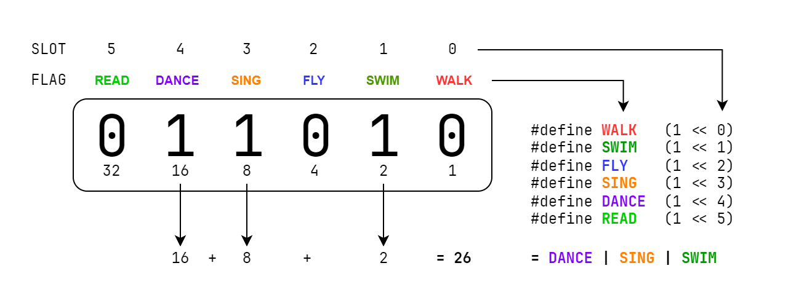

# Bitflags

Let's say we wanted to store the abilities of a player. We could create a set of
variables like this:

```dm
/mob/player
	var/can_walk = TRUE
	var/can_swim = FALSE
	var/can_fly = FALSE
	var/can_sing = TRUE
	var/can_dance = FALSE
	var/can_read = TRUE
```

This isn't very clean or extensible. If we added a new ability, we'd have to add
a new variable. Instead, we can store all of these in a single variable using
_bitflags_.

Bitflags are a way of storing many pieces of information in a single number.

This is a simplification, but when you assign a number to a variable, that
number is stored in binary. If you write:

```dm
var/player_abilities = 41
```

Internally, BYOND stores the number 41 as the binary value `101001`. If we think
of every `0` and `1` in binary as representing an on/off switch, then we can
store lots of switches in a single number, by associating every binary digit
with a setting.

To be able to access each "on/off" switch in that number, we create a set of
defines. Each one represents one thing we want to toggle. We use the _bitwise
left shift_ operator, `<<`, to make reading them easier:

```dm
#define WALK   (1 << 0)  // 000001 =  1 in binary
#define SWIM   (1 << 1)  // 000010 =  2 in binary
#define FLY    (1 << 2)  // 000100 =  4 in binary
#define SING   (1 << 3)  // 001000 =  8 in binary
#define DANCE  (1 << 4)  // 010000 = 16 in binary
#define READ   (1 << 5)  // 100000 = 32 in binary
```

A bitwise left shift "shifts" the value 1 to each place in a binary
digit. If our binary value has 6 places, i.e. `000000`, then `(1 << 0)`
represents a `1` in the "zeroth" place: `000001`. Then `(1 << 1)` represents a
`1` in the first place: `000010`, and so on. These are still specific numbers;
we are just representing them in a unique way. For example, `(1 << 3)` is equal
to 8 in base ten, and is equal to `001000` in binary.



> [!WARNING]
>
> Because of how BYOND represents numbers, a single number can only hold 24
> flags. In other words, once the amount of flags you wish to represent in a
> number reaches `(1 << 23)`, you have run out of available places to store
> flags in that variable.
>
> The technical explanation is: BYOND has a single numeric datatype stored as
> 32-bit IEEE 754 floating point. Performing bitwise operations on numbers in
> BYOND converts the number to its integer representation, using the 24 bits of
> the significand in the floating point representation, and then back to
> floating point afterwards.

## Operating on Bitflags

There will be several kinds of operations you'll want to perform on bitflags.
These operations are performed using _binary arithemetic operators_.

> [!NOTE]
>
> This guide only describes the most common bitflag operations. For a deeper
> dive into binary arithmetic and more complex operators, see the
> [Advanced Bitflags](./adv_bitflags.md) reference.

### Setting and Unsetting

In order to set flags, use the OR bitwise operator, `|`:

```dm
var/player_abilities = WALK | SING | READ
```

This "toggles" the slots for the provided flags and returns the result. In this
case, the value of `player_abilities` is now the number 41, because that is the
sum of the values represented by those three individual flags.

In other words, the value of these two variables is the same:

```dm
var/alice_abilities = 41
var/brian_abilities = WALK | SING | READ
```

The OR bitwise operator can also be used in assignment. For example:

```dm
var/player_abilities = WALK
player_abilities |= SING
player_abilities |= READ
```

This results in the same value as above.

If you have a flag you wish to toggle "off", you will use a combination of
bitwise AND (`&`) and negation (`~`). For example, if we wanted to remove
`SING` from the bitflag above:

```dm
player_abilities &= ~SING
```

This removes `SING` from the bitflag while keeping the other values set.

### Checking

In order to see if a bitflag has a specific flag toggled, use the bitwise AND
(`&`) operator in a conditional:

```dm
if(player_abilities & READ)
	world << "Player can read!"

if(!(player_abilities & SING))
	world << "Player can't sing!"
```

## Important Notes

### Use flags for unique settings

Bitflags should be used when it makes sense that multiple flags can be set
simultaneously. For example, it would not make sense to make the following
bitflag:

```dm
#define CAN_WALK    (1 << 0)
#define CANNOT_WALK (1 << 1)
```

Because then both values can be toggled on in a single variable. Only use
bitflags when it makes sense to toggle any or all of the flags simultaneously.
