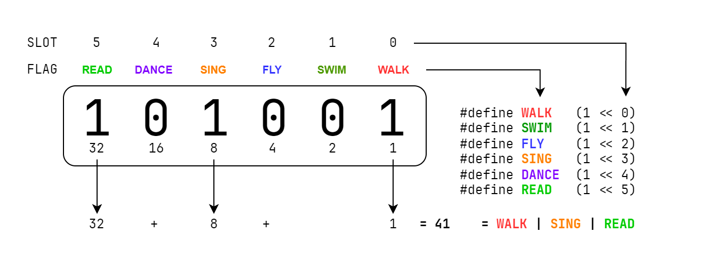

# Bitflags

Let's say we wanted to store the abilities of a player. We could create a set of
variables like this:

```dm
/mob/player
	var/can_walk
	var/can_swim
	var/can_fly
	var/can_sing
	var/can_dance
	var/can_read
```

This isn't very elegant or extensible. If we wanted to add new abilities, we'd
have to add a new variable for each new ability. Instead, we can store all of
these in a single variable using bitflags.

Bitflags are a way of storing many TRUE/FALSE values in a single number, and are
often used in BYOND to save space and make it easy to read settings from a
variable.

Binary is a series of 1s and 0s, and any number can be represented in binary. By
representing TRUE as 1 and FALSE as 0, we can then use any number to represent a
series of TRUE/FALSE values.

Bitflags are defined with the bitshift operator (`<<`) to make reading them
easier:

```dm
#define WALK   (1 << 0)  // 000001 =  1 in binary
#define SWIM   (1 << 1)  // 000010 =  2 in binary
#define FLY    (1 << 2)  // 000100 =  4 in binary
#define SING   (1 << 3)  // 001000 =  8 in binary
#define DANCE  (1 << 4)  // 010000 = 16 in binary
#define READ   (1 << 5)  // 100000 = 32 in binary
```

A bitshift essentially "shifts" the value 1 to each place in a binary digit. If
our binary value has 6 places, i.e. `000000`, then `(1 << 0)` represents a `1`
in the "zeroth" place: `000001`. Then `(1 << 1)` represents a `1` in the first
place: `000010`, and so on.

Because every combination of 1s and 0s is a distinct number, this means that you
will always be able to look at the number and pull the individual values from it
using binary arithmetic.



Bitflags should be used when it makes sense that multiple flags can be set
simultaneously. For example, it would not make sense to make the following
bitflag:

```dm
#define CAN_WALK    (1 << 0)
#define CANNOT_WALK (1 << 1)
```

Because then both values can be toggled on in a single variable. Only use
bitflags when it makes sense to toggle any or all of the flags simultaneously.

> [!WARNING]
>
> Because of how BYOND represents numbers, a single variable can only hold 24 flags.
> In other words, once the number of flags you wish to represent in a number reaches
> `(1 << 23)`, you have run out of available places to store flags in that variable.
>
> The technical explanation is: BYOND has a single numeric datatype stored as
> 32-bit IEEE 754 floating point. Performing bitwise operations on numbers in
> BYOND converts the number to its integer representation, using the 24 bits of
> the significand in the floating point representation, and then back to
> floating point afterwards.

## Operating on Bitflags

### Setting and Unsetting

There will be several kinds of operations you'll want to perform on bitflags.
The first will be setting them. This can be done by setting them all at once
using the OR bitwise operator, `|`:

```dm
var/player_abilities = DANCE | SING | SWIM
```

This "toggles" the slots for the provided flags and returns the result. In this
case, the value of `player_abilities` is now the number 26, because that is the
sum of the values represented by those three individual flags.

The OR bitwise operator can also be used in assignment. For example:

```dm
var/player_abilities = DANCE
player_abilities |= SING
player_abilities |= SWIM
```

This results in the same value as above.

If you have a flag you wish to toggle "off", you will use a combination of
bitwise AND (`&`) and negation (`~`). For example, if we wanted to remove
`DANCE` from the bitflag above:

```dm
player_abilities &= ~DANCE
```

This removes `DANCE` from the bitflag while keeping the other values set.

### Checking

In order to see if a bitflag has a specific flag toggled, use the bitwise AND
(`&`) operator in a conditional:

```dm
if(player_abilities & DANCE)
	world << "Player can dance!"

if(!(player_abilities & SING))
	world << "Player can't sing!"
```
