# Spriting Quickstart

## What Is Spriting?

Spriting is the act of editing icons, otherwise known as .dmi files. These files
make up every image you see in-game. These files can be edited with BYOND's
tools (Dream Maker) or external programs such as spriting software.

## Tools

### Icon Conflicts

If you have published a PR that affects the icons of a file, and another PR that
affects other icons in that file is merged before yours, you will likely have a
merge conflict. Because git cannot read icon files, you will be unable to use
git to resolve these merge conflicts.

To deal with this, a merge hook is integrated into git and can be installed to
automatically resolve these conflicts wherever possible.

To install this hook, run `\tools\hooks\Install.bat`.

### Spriting Program

The most important thing you will need for spriting is a tool or program to
allow you to sprite. The default available tool is Dream Maker. However, many
find Dream Maker difficult to work with for the creation of sprites. Some
preferred programs are as follows:

- [Aseprite](https://www.aseprite.org/), a paid spriting program
- [Libresprite](https://libresprite.github.io), a free, older version of Aseprite
- [paint.net](https://www.getpaint.net/download.html), a free image editor, useful at small scales

These offer you all the tools you'll need and more to sprite properly.

### Dream Maker

Dream Maker is the default tool for editing code, icons, and maps, which comes
packaged with BYOND. It will be needed to edit .dmi files.

Once you open a .dmi file, you should see a grid of sprites. Hovering your
cursor over will play an animation and cycle through directionals, if there are
any.

## Locating Sprites

To locate a sprite, begin by finding the code definition of the object, or any
parents of the object. Under its variables, there should be the following:

- `icon = 'icons/path/abc.dmi'` - The icon refers to the file storing the image
- `icon_state = "abc"` - The icon_state refers to the exact image used from the file

## Importing .png Files

To import a sprite from a .png, you can press Ctrl+I or right-click anywhere and
click "import" to select the png. Make sure that the png is either 128x32 or
64x64 depending on preference, and the sprites are lined up in 32x32 squares,
with directionals South, North, East, and West from left to right.

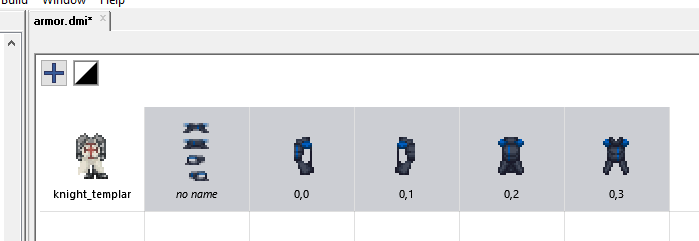

Delete the sprite titled "no name". It is a combination of all four sprites and
will not be used. Drag or Ctrl+Click to select all 4 directionals. Then, right
click and choose "combine, 4 directions first".

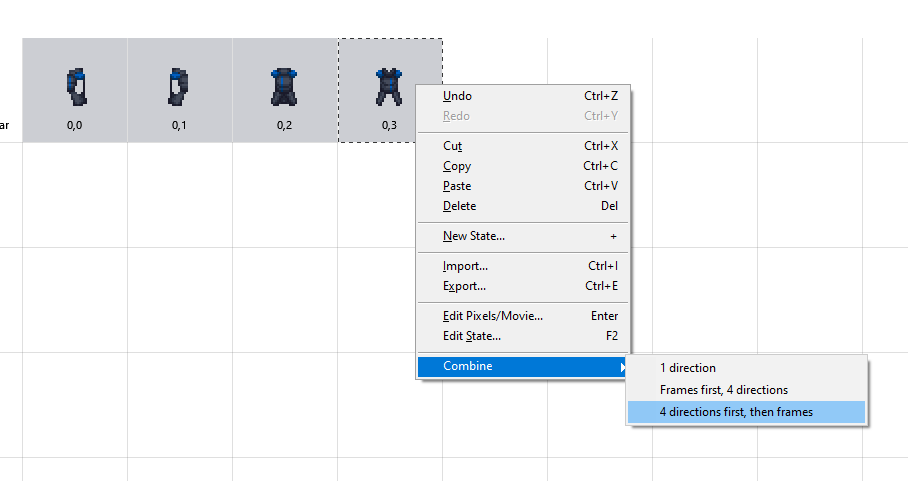

Double-click the sprite to enter the editor and Shift+Click the directionals to
arrange them in proper order if they are not already.

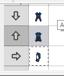

Double-click the text or press F2 with the sprite selected to edit its title.

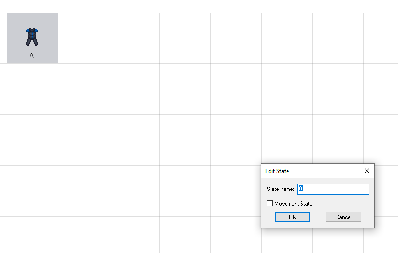

The end result should look like this.

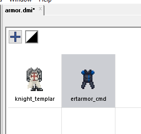

## The Editor

Double-clicking a sprite will open the editor. The editor provides basic,
although inefficient tooling to draw sprites. On the bottom, there will be a
grid with directionals (top to bottom) and animation frames (left to right),
like so.

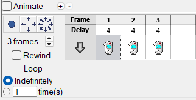

The buttons depicting a dot and arrows decide the amount of directions this
sprite can face. This is used for structures, machines, and mobs that can be
turned to face different directions.

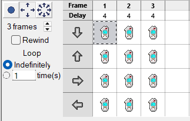

Click to select a frame, Drag to select multiple frames, Shift+Drag to swap
frames with each other, and Ctrl+Drag to copy frames.

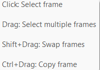

### Guide to Spriting

A common issue when beginning to sprite is not knowing where to start the
drawing. Below, images and descriptions will be provided to show the
step-by-step process of creating a simple device sprite.

First, create a palette. 3-5 colors are ideal. Pick a base tone, 1 highlight,
and 2 shades for a 4-shade sprite, which is the most common. Remember to hue
shift.

Next, create a rough, symmetrical outline of the device using one of the shades,
then fill it in with the base color. Remember to keep it at 3/4, topdown,
45-degree perspective. The left and right sides should not be visible.

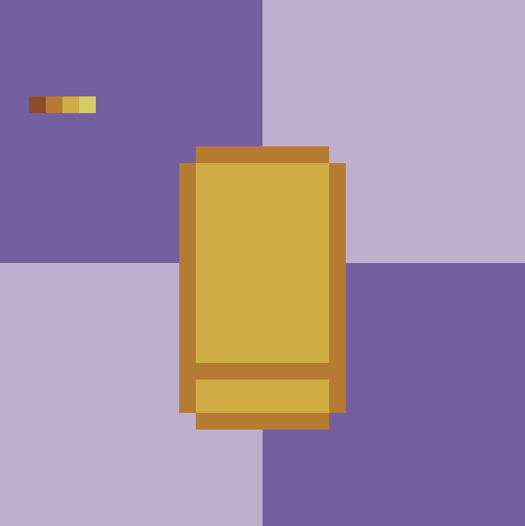

Then, turn that "bar" separating the top face from the front face into a
highlight. Make the front face and its outline darker than the top face, or make
the top face and its outline brighter than the front face.

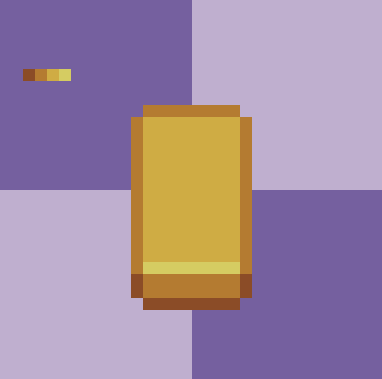

Then, make sure any pixels where two lines of the same color intersect are made
a shade darker, and pixels where a highlight and an outline intersect are made a
shade brighter.

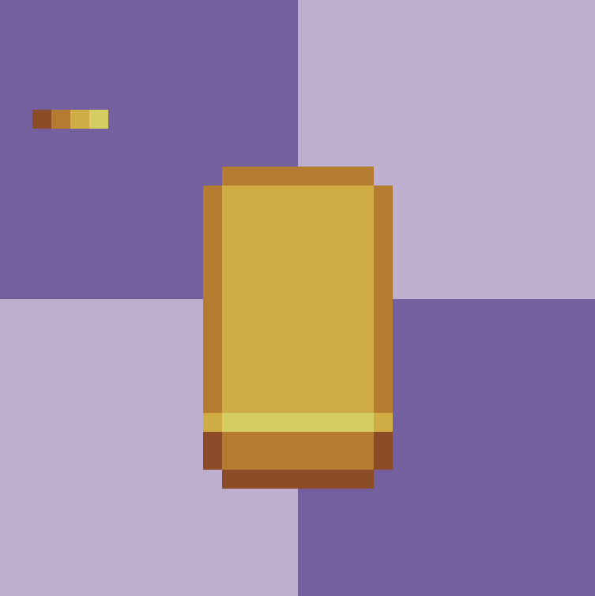

Now that a simple sprite is complete, add details. In this example, more
highlights, a screen, two buttons, a grip, and two prongs. The screen will be
indenting, so the highlight will be on the bottom. If it were extruding, the
highlight would be on the top.

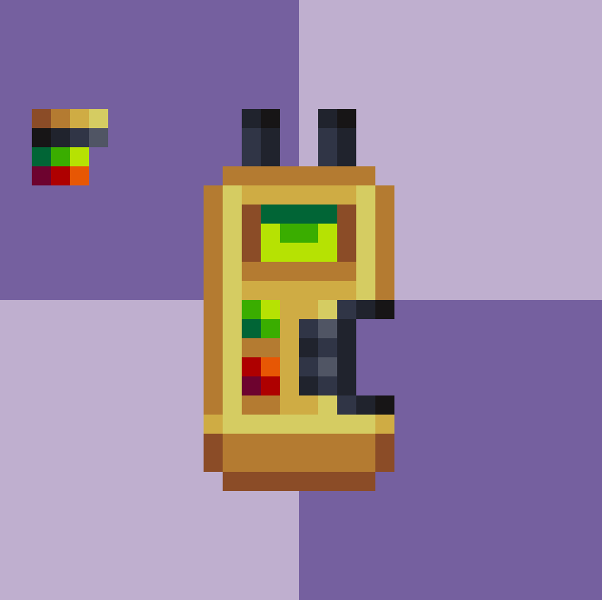

# Porting Sprites

It is allowed to port sprites from another server for use on Paradise, so long
as licensing is considered. However, be wary that different servers have varying
styles which can severely mismatch with the style of Paradise Station.

Currently, the Sprite Team's verdict on porting sprites from other codebases is
as follows:

1. If it is a common outfit, such as departmental clothing, please do not port
   anything of this nature unless it is going to be a NEW item, not a
   replacement for an old one.

2. For commonly-used/commonly-seen machinery/items, these should be original
   sprites. However, these will be reviewed on a case-by-case basis.

3. For uncommon or off-station clothing, ports may be allowed on a case-by-case
   basis

4. For uncommon machinery/items, ports will generally be accepted provided they
   are better than the original item, however they may still not fit with the
   server's style.

5. Sprites created originally by Paradise contributors take priority over ported
   sprites.

TLDR: If you want to port sprites for anything, reach out to Sprite Team before
making PR progress towards it. Your PR may be denied if another opens with
original sprites.
