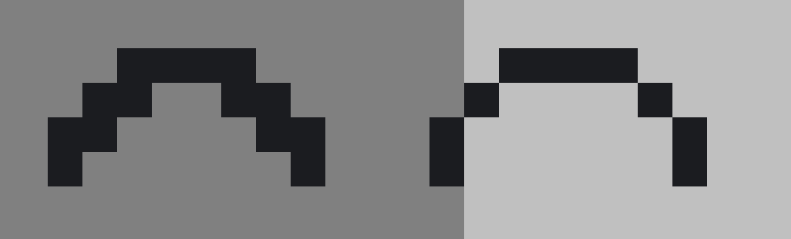

## Design Guidelines

The design for sprites on Paradise should follow the likes of media such as
Alien, Fallout, Half-Life/Black Mesa, and Star Trek. Generally, aim for cassette
retrofuturism, an aesthetic based on what the future would have looked like from
the perspective of the mid-1960s to the early 1990s.

This can be applied in several ways. Machines will be offwhite or beige.
Machines and objects should be clunky, bulky, and clearly dated equipment that
has survived to the current era, such as magnetic-tape data storage or fax
machines.

When designing departmental clothes, there are a few things to be considered.

For all roles:

Roles of the same department should generally use the same palette for the main
body, with the exception of Service. For example, Engineers and Atmospheric
Technicians have a yellow body color, but the secondary color changes, being
orange for Engineers and blue for Atmospheric Technicians.

For working-class roles (engineers, miners, roboticists):

- Simple collared uniform. This will be the same as other roles, except with its
  own unique coloring and patterns.
- Overalls
- Soft caps
- Corporate (alternate style) uniform. This can be clothing pertaining to the
  role (such as an atmos tech in a hi-vis firefighter's uniform), or a simple
  color swap.

For higher-up roles (heads of staff, dignitaries):

- Separated shirt and pants
- Primary color should match the department they lead
- Secondary color should be silver, gold, or any other fitting color.
- Any amount of alternate outfits, ranging from ridiculously posh to casual or
  practical wear.

## Spriting Guidelines

Spriting is an art form, and it varies depending on what's being sprited for.
Here are some standards used on Paradise when creating sprites.

1. Almost all sprites are drawn at a 3/4 top-down 45-degree angle. Sprites
   should be orthographic, meaning there is no perspective. If a sprite gets
   smaller as they move into the distance, the perspective is off.

2. Almost all sprites are drawn on a 32x32 canvas. Anything larger than 32x32
   should be separated and labelled as such.

3. Directionals, the sprites used for different directions, should be limited to
   1 for static objects that do not need to turn and 4 for objects that must be
   able to turn, such as mobs and clothing. The use of 8 directionals should be
   limited to certain items, such as those with arrows that point diagonally.

4. Light comes from directly above the object. This should be taken into
   consideration when shading, especially with indents and various irregular
   shapes.

5. When choosing a palette, it is highly recommended to utilize hue shifting.
   Hue shifting is adjusting the hue alongside brightness. Darker colors become
   colder, or more blue, and lighter colors become warmer, or more yellow. Cold
   and warm vary depending on the hue you start with. This creates more vibrant,
   dynamic sprites.

6. Outlines should also be affected by the lighting and coloring on the object,
   and should be a darker variant of the primary color.

7. Typically, avoid adding shadows underneath objects, machines, mobs, or other
   structures.

Common Mistakes

1. The use of solid black or otherwise unfitting colors in outlines. Outlines
   should be a darker variant of the primary color.

2. Too many colors, especially when representing a light source or gradient.
   Limit the palette and work with what's available. Typically, 3-5 colors is
   ideal for any given sprite, though it's not restricted to use more or less.

3. Using one hue and its shades instead of hue shifting will result in a dull
   sprite.

4. No source of light, causing inconsistencies in shading.

5. Pillow shading, a form of shading in which light comes from the center of the
   object. Avoid pillow shading entirely.

6. Staircasing your pixels rather than placing them directly diagonal from each
   other can cause lines to be much thicker than they should be. Avoid
   staircasing whenever possible unless the intent is for a portion or outline
   to look thicker.

   The following image shows an example of staircasing on the left, with a more
   appropriate outlining on the right.

   

7. Orphan pixels are pixels that are isolated from other pixels of the same or
   similar pixels. They create contrast and distract the viewer.
